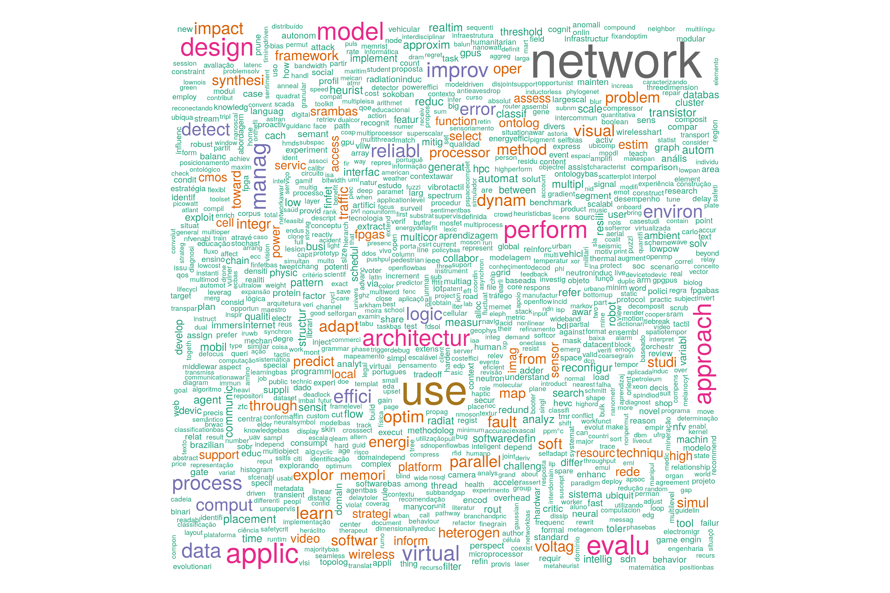
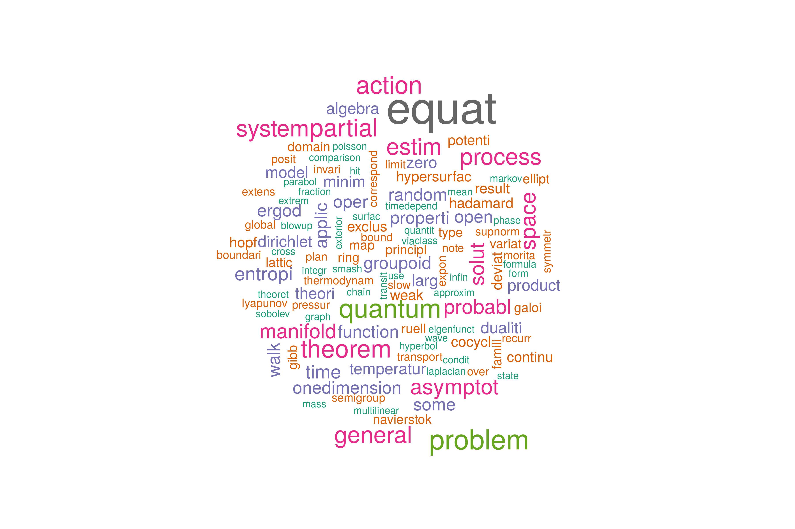
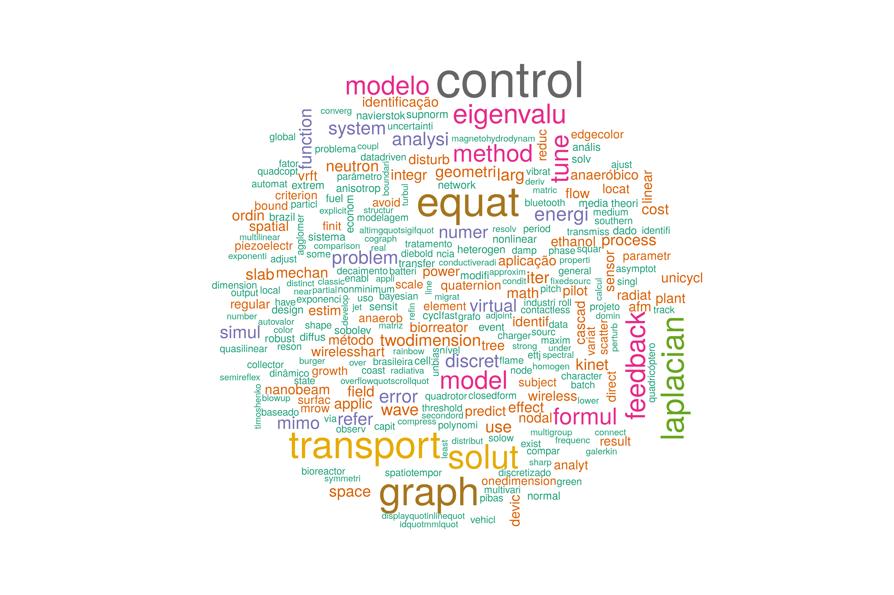

---
output:
  html_document: default
  pdf_document: default
---
## 5.1. Códigos para carregar bibliotecas e arquivos JSON:

```{r, message = FALSE, warning = FALSE}
library(tidyverse)
library(jsonlite)
library(listviewer)
library(scales)
library(igraph)
library(wordcloud)
library(tm)
library(wordcloud)
source("elattes.ls2df.R")
```

# Testando com arquivos da computação

```{r}
#Arquivos JSON computação
advise.comp <- jsonlite::fromJSON("advisecomp.json")
profile.comp <- jsonlite::fromJSON("profilecomp.json")
publication.comp <- jsonlite::fromJSON("publicationcomp.json")
graph.comp <- jsonlite::fromJSON("graphcomp.json")
```

```{r}
#Arquivos JSON matemática
advise.mat <- jsonlite::fromJSON("advisemat.json")
profile.mat <- jsonlite::fromJSON("profilemat.json")
publication.mat <- jsonlite::fromJSON("publicationmat.json")
graph.mat <- jsonlite::fromJSON("graphmat.json")
```

```{r}
#Arquivos JSON matemática aplicada
advise.mapl <- jsonlite::fromJSON("advisemapl.json")
profile.mapl <- jsonlite::fromJSON("profilemapl.json")
publication.mapl <- jsonlite::fromJSON("publicationmapl.json")
graph.mapl <- jsonlite::fromJSON("graphmapl.json")
```

# Mineração de Texto

# Coletando informacoes da producao
```{r}
pr.df.pubcomp <- extrai.producoes(profile.comp)
pr.df.areascomp <- extrai.areas.atuacao(profile.comp)

pr.df.pubmat <- extrai.producoes(profile.mat)
pr.df.areasmat <- extrai.areas.atuacao(profile.mat)

pr.df.pubmapl <- extrai.producoes(profile.mapl)
pr.df.areasmapl <- extrai.areas.atuacao(profile.mapl)

```

# Gráfico de palavras

## Títulos de publicações

Na grande maioria os títulos das publicações estão em inglês, fato positivo, no qual demonstra a preocupação das pós da UFRGS não só em difundir a informação para o Brasil, mas também para o exterior

```{r}
# Computação
pub_titulos <- pr.df.pubcomp %>% filter(grepl("COMPLETO", natureza)) %>% select(titulo)
pub_titulos_p_corp <- VCorpus(VectorSource(pub_titulos))
auxCorpus <- tm_map(pub_titulos_p_corp, removePunctuation)
auxCorpus <- tm_map(auxCorpus, stripWhitespace)
# Convert the text to lower case
auxCorpus <- tm_map(auxCorpus, content_transformer(tolower))
# Remove numbers
auxCorpus <- tm_map(auxCorpus, removeNumbers)
auxCorpus <- tm_map(auxCorpus, removeWords, c(stopwords('pt'), "and", "the", "use", "with"))
auxCorpus <- tm_map(auxCorpus, stemDocument)
# Plot a wordcloud using freq values
set.seed(1234)
png("wordcloud_comp.png", width=12, height=8, units='in', res=300)
wordcloud(words = auxCorpus,colors=brewer.pal(8, "Dark2"))

```

É possível perceber que os títulos de publicações da pós-graduação de Computação é bem variado visto que há diversas palavras pequenas, e é visível algumas palavras que estão em vários títulos como network, model, design

```{r}
# Matemática
pub_titulos <- pr.df.pubmat %>% filter(grepl("COMPLETO", natureza)) %>% select(titulo)
pub_titulos_p_corp <- VCorpus(VectorSource(pub_titulos))
auxCorpus <- tm_map(pub_titulos_p_corp, removePunctuation)
auxCorpus <- tm_map(auxCorpus, stripWhitespace)
# Convert the text to lower case
auxCorpus <- tm_map(auxCorpus, content_transformer(tolower))
# Remove numbers
auxCorpus <- tm_map(auxCorpus, removeNumbers)
auxCorpus <- tm_map(auxCorpus, removeWords, c(stopwords('pt'), "and", "the", "use", "with"))
auxCorpus <- tm_map(auxCorpus, stemDocument)
# Plot a wordcloud using freq values
set.seed(1234)
png("wordcloud_mat.png", width=12, height=8, units='in', res=300)
wordcloud(words = auxCorpus,colors=brewer.pal(8, "Dark2"))

```

Como a matemática tem menos títulos que a computação, exitem menos palavras na wordcloud, e as palavras com destaque nos títulos são equat, problem, quantum

```{r}
# Matemática Aplicada
pub_titulos <- pr.df.pubmapl %>% filter(grepl("COMPLETO", natureza)) %>% select(titulo)
pub_titulos_p_corp <- VCorpus(VectorSource(pub_titulos))
auxCorpus <- tm_map(pub_titulos_p_corp, removePunctuation)
auxCorpus <- tm_map(auxCorpus, stripWhitespace)
# Convert the text to lower case
auxCorpus <- tm_map(auxCorpus, content_transformer(tolower))
# Remove numbers
auxCorpus <- tm_map(auxCorpus, removeNumbers)
auxCorpus <- tm_map(auxCorpus, removeWords, c(stopwords('pt'), "and", "the", "use", "with"))
auxCorpus <- tm_map(auxCorpus, stemDocument)
# Plot a wordcloud using freq values
set.seed(1234)
png("wordcloud_mapl.png", width=12, height=8, units='in', res=300)
wordcloud(words = auxCorpus, colors=brewer.pal(8, "Dark2"))

```

Já a matemática aplicada possui um destaque de tranpost, solut, laplacian, control, equat nos títulos das publicações

# Analise de Redes

## Professores nos quais publicaram juntos

Utilizando um grafo no formato de círculo para facilitar a visualiação das conexões entre os docentes
```{r}
# Computação
gcomp <- graph_from_data_frame(graph.comp$links, directed = FALSE, vertices = graph.comp$nodes)

plot(gcomp, layout = layout_in_circle,
edge.width = 1,
edge.arrow.width = 1,
vertex.size = 5,
edge.arrow.size = 0.1,
vertex.size2 = 3,
vertex.label.cex = 0.5,
vertex.label = graph.comp$nodes$properties$name,
asp = 0.35,
margin = -0.1,)
```

O grafo está bem interligado, o que demonstra uma alta relação entre os professores da pós-graduação de computação

```{r}
# Matemática
gmat <- graph_from_data_frame(graph.mat$links, directed = FALSE, vertices = graph.mat$nodes)

plot(gmat, layout = layout_in_circle,
edge.width = 1,
edge.arrow.width = 1,
vertex.size = 5,
edge.arrow.size = 0.1,
vertex.size2 = 3,
vertex.label.cex = 0.5,
vertex.label = graph.mat$nodes$properties$name,
asp = 0.35,
margin = -0.1,)
```

O grafo demonstra que os docentes da matemática não possuem muitas publicações em conjutos
```{r}
# Matemática Aplicada
gmapl <- graph_from_data_frame(graph.mapl$links, directed = FALSE, vertices = graph.mapl$nodes)

plot(gmapl, layout = layout_in_circle,
edge.width = 1,
edge.arrow.width = 1,
vertex.size = 5,
edge.arrow.size = 0.1,
vertex.size2 = 3,
vertex.label.cex = 0.5,
vertex.label = graph.mapl$nodes$properties$name,
asp = 0.35,
margin = -0.1,)
```

O grafo da matemática aplicada mostra um grau de integração dos docentes maior que da matemática,porém ainda muito inferior em relação a computação

## Analisando as comunidades

Para analisar a integração dos docentes, é gerado um grafo usando o algoritmo fastgreedy community do igraph.Nessa etapa primeiramente é gerada as comunidades dos docentes, depois é analisada as áreas de atuações dos 3 maiores grupos

## Gráfico das comunidades de computação
``` {r}
# Computação
kc = fastgreedy.community(gcomp)
plot(kc, gcomp, vertex.label=NA, edge.arrow.width = gcomp$weigth)
```

O gráfico reforça a ideia do anterior, na qual os docentes da pós de computação, publicam bastante em conjunto um com os outros.Os cluters sobrepostos indicam que não há uma segregação entre os docentes e também possível ver dois docentes que atuam sozinho porém os demais trabalham em conjuntos fortalendo e melhorando a pós-graduaçao

# Analisando as 3 primeiras comunidades
##Analisando a sub_area de atuação da comunidade 1
```{r}

perfis.1 <- pr.df.areascomp %>%
select(idLattes,sub_area) %>%
filter(idLattes %in% names(membership(kc)[membership(kc) == 1]))
perfis.1 <- perfis.1[!duplicated(perfis.1),] %>%
group_by(sub_area) %>%
summarise(Quantidade = n()) %>%
filter(sub_area != "")
perfis.1[order(-perfis.1$Quantidade),]
```

## Analisando a sub_area de atuação da comunidade 2
```{r}
perfis.2 <- pr.df.areascomp %>%
select(idLattes,sub_area) %>%
filter(idLattes %in% names(membership(kc)[membership(kc) == 2]))
perfis.2 <- perfis.2[!duplicated(perfis.2),] %>%
group_by(sub_area) %>%
summarise(Quantidade = n()) %>%
filter(sub_area != "")
perfis.2[order(-perfis.2$Quantidade),]
```

## Analisando a sub_area de atuação da comunidade 3
```{r}
perfis.3 <- pr.df.areascomp %>%
select(idLattes,sub_area) %>%
filter(idLattes %in% names(membership(kc)[membership(kc) == 3]))
perfis.3 <- perfis.3[!duplicated(perfis.3),] %>%
group_by(sub_area) %>%
summarise(Quantidade = n()) %>%
filter(sub_area != "")
perfis.3[order(-perfis.3$Quantidade),]
```

## Gráfico das comunidades da matemática
``` {r}
# Matemática
kc = fastgreedy.community(gmat)
plot(kc, gmat, vertex.label=NA, edge.arrow.width = gmat$weigth)
```

Esse grafo reforça a afirmação do script anterior de que os docentes pós-graduação de mátematica fazem poucas publicações juntos, é possivel ver 3 clusters com em média 5 docentes e mais 11 docentes que trabalham sozinhos

# Analisando as 3 primeiras comunidades

Analisando a sub_area de atuação da comunidade 1
```{r}
perfis.1 <- pr.df.areasmat %>%
select(idLattes,sub_area) %>%
filter(idLattes %in% names(membership(kc)[membership(kc) == 1]))
perfis.1 <- perfis.1[!duplicated(perfis.1),] %>%
group_by(sub_area) %>%
summarise(Quantidade = n()) %>%
filter(sub_area != "")
perfis.1[order(-perfis.1$Quantidade),]
```

Analisando a sub_area de atuação da comunidade 2
```{r}
perfis.2 <- pr.df.areasmat %>%
select(idLattes,sub_area) %>%
filter(idLattes %in% names(membership(kc)[membership(kc) == 2]))
perfis.2 <- perfis.2[!duplicated(perfis.2),] %>%
group_by(sub_area) %>%
summarise(Quantidade = n()) %>%
filter(sub_area != "")
perfis.2[order(-perfis.2$Quantidade),]
```

Analisando a sub_area de atuação da comunidade 3
```{r}
perfis.3 <- pr.df.areasmat %>%
select(idLattes,sub_area) %>%
filter(idLattes %in% names(membership(kc)[membership(kc) == 3]))
perfis.3 <- perfis.3[!duplicated(perfis.3),] %>%
group_by(sub_area) %>%
summarise(Quantidade = n()) %>%
filter(sub_area != "")
perfis.3[order(-perfis.3$Quantidade),]
```

## Gráfico das comunidades da Matemática aplicada
``` {r}
# Matemática Aplicada
kc = fastgreedy.community(gmapl)
plot(kc, gmapl, vertex.label=NA, edge.arrow.width = gmapl$weigth)
```

Nesse grafo é possível ver um cluster(Fundo laranja e bolinhas azuis) onde todos professores já trabalham com os outros. Porém no demais há pouca relação, dado o fato que há 8 professores que nunca publicaram com um os outros professores da pós de matemática aplicada

# Analisando as 3 primeiras comunidades
Analisando a sub_area de atuação da comunidade 1
```{r}
perfis.1 <- pr.df.areasmapl %>%
select(idLattes,sub_area) %>%
filter(idLattes %in% names(membership(kc)[membership(kc) == 1]))
perfis.1 <- perfis.1[!duplicated(perfis.1),] %>%
group_by(sub_area) %>%
summarise(Quantidade = n()) %>%
filter(sub_area != "")
perfis.1[order(-perfis.1$Quantidade),]
```
Analisando a sub_area de atuação da comunidade 2
```{r}
perfis.2 <- pr.df.areasmapl %>%
select(idLattes,sub_area) %>%
filter(idLattes %in% names(membership(kc)[membership(kc) == 2]))
perfis.2 <- perfis.2[!duplicated(perfis.2),] %>%
group_by(sub_area) %>%
summarise(Quantidade = n()) %>%
filter(sub_area != "")
perfis.2[order(-perfis.2$Quantidade),]
```
Analisando a sub_area de atuação da comunidade 3
```{r}
perfis.3 <- pr.df.areasmapl %>%
select(idLattes,sub_area) %>%
filter(idLattes %in% names(membership(kc)[membership(kc) == 3]))
perfis.3 <- perfis.3[!duplicated(perfis.3),] %>%
group_by(sub_area) %>%
summarise(Quantidade = n()) %>%
filter(sub_area != "")
perfis.3[order(-perfis.3$Quantidade),]
```