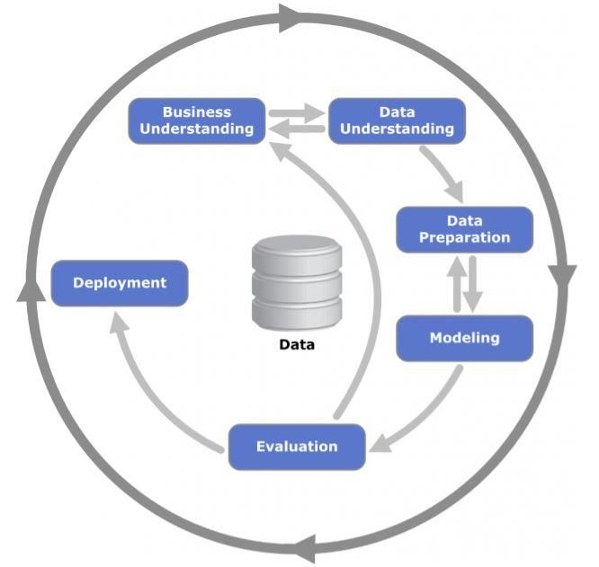

Professores: Jorge Henrique Cabral Fernandes, Ricardo Barros Sampaio

```{r setup, include=FALSE}
knitr::opts_chunk$set(echo = FALSE, out.width = '80%')
```


# 1. Introdução

Este documento consiste no relatório do grupo 10 da disciplina Data Science For All (Ciência de Dados para Todos) - 2019.1, do Departamento de Ciência da Computação da Universidade de Brasília (UnB).

Tem como objetivo apresentar as análises descritivas, quantitativas e de modelagem realizadas dos programas de pós-graduações da Universidade Federal do Rio Grande do Sul (UFRGS).

Os programas relativos às áreas de Ciências Exatas e da Computação tratados pelo grupo 10 são:

* Computação;
* Estatística;
* Matemática;
* Matemática Aplicada.


# 2. Metodologia - CRISP DM

Para um melhor resultado buscou-se seguir e adaptar-se a metodologia Cross Industry Standard Process for Data Mining (CRISP-DM). É uma metodologia própria para processos de mineração de dados.

Seus fundamentos e princípios mais relevantes, descritos por Fernandes, Jorge H C, Ricardo Barros Sampaio, João Ribas de Moura e Jerônimo AVelar Filho. "Ciência de Dados para Todos (Data Science For All) - 2019.1 - Análise da Produção Científica e Acadêmica - Modelo de Relatório Final da Disciplina - Departamento de Ciência da Computação da UnB". Para isso baseou-se no ciclo de projeto da metodologia CRISP-DM.


## 2.1. Entendimento do Negócio

Primeiramente deve-se entender o que se busca encontrar, haja visto que não faz sentido fazer uma análise de dados sem saber o que se busca.


## 2.2. Entendimento dos Dados

Busca-se entender os dados de forma mais superficial inicialmente. Também faz parte dessa etapa a análise e verificação da qualidade dos dados identificando possíveis informações inexistentes ou erradas e se a quantidade obtida atende para as análises.


## 2.3. Preparação dos Dados

Com o objetivo de facilitar a análise e extração das informações dos dados coletados, é necessário que se passe por um tratamento. Nesta etapa são feitas as limpezas, seleções, formatação e, se necessário, construção de novos dados derivados dos já obtidos.


## 2.4. Modelagem

Feito a formatação dos dados entramos na modelagem. Utilizamos ferramentas e técnicas com a finalidade de obter o melhor resultado.


## 2.5. Avaliação dos Resultados

Com os resultados obtidos da modelatem é verificado se todos os objetivos e objetos de estudos foram abordados estão presentes nos resultados e se estão corretamente exibidos.


## 2.6. Implantação

Utilização dos dados.


Para melhor visualização das fases e a comunicação entre elas, deve-se observar a seguir. Por esta figura consegue-se perceber que, por exemplo, o entendimento do negócio e do dado pode muitas vezes ser se alternar no ciclo da metodologia adotada.




# 3. Ciência

## 3.1. O que é Ciência?

Aristóteles define a ciência como o "conhecimento das causas pelas causas. É o conhecimento demonstrativo".
  
A ciência é composta por três componentes: a observação, a experimentação e as leis. Visa a união entre o conhecimento teórico, a prática e a técnica. Não se utiliza de suposições, mas da comprovação após a aplicação do método científico.
  
Foi o próprio Aristóteles quem definiu que as ciências (no plural) estão relacionadas à maneira de realização do ideal de cientificidade de acordo com os fatos investigados e os métodos empregados.
  
Os critérios utilizados para classificar a ciência são: Ausência ou presença da ação humana no fato objeto da investigação; Imutabilidade; Mobilidade prática; Classificação das ciências.
  
A realização da ciência, por meio da produção científica, é uma atividade essencialmente social, realizada por seres humanos, chamados de cientistas ou investigadores. A organização metódica da produção científica é baseada em um conjunto de princípios que vêm sendo aperfeiçoados ao longo dos milênios, mas que não deixam de ser questionados.
  
Atualmente a ciência está muito desenvolvida e desempenha um papel muito importante na nossa sociedade em imensas áreas do saber, provavelmente em todas. Sem a Ciência desenvolvida como está hoje, quem vivia até aos 100 anos? Quem tinha telemóvel, computador ou internet? Quem tinha luz? Quem andava de carro, de avião ou de comboio? Quem curava uma doença difícil? O mundo não era o que é hoje se não houvesse uma ciência tão desenvolvida.
  
Dando agora um exemplo, a NASA, Agência Americana responsável pela pesquisa e tecnologia da exploração espacial, não só contribuiu para a evolução do conhecimento sobre o espaço, mas também para algumas criações do dia-a-dia, como o isolamento térmico, sapatilhas desportivas, a TAC, um melhor software, detectores de minas, painéis solares, detetores de fumo, bombas de insulina, membros artificiais, satélites de comunicações, preservação prolongada dos
alimentos.


## 3.2. O que é Ciência no Brasil?

A História da Ciência no Brasil começou eficazmente somente nas primeiras décadas do século XIX, quando a família real portuguesa, dirigida por D. João VI, chegou em Rio de Janeiro, escapando-se da invasão do exército de Napoleão em 1807. Até então, o Brasil não era muito mais do que uma colônia pobre, sem universidades, mídias impressas, bibliotecas, museus, etc, em um contraste absoluto às colônias da Espanha, que tiveram universidades desde o século XVI. Esta era uma política deliberada do poder colonial português, porque temiam que aparecessem classes de brasileiros educados impulsionados pelo nacionalismo e outras aspirações para a independência política, porque tinha acontecido nos EUA e em diversas colônias espanholas da América latina.

A criação do Instituto Oswaldo Cruz, no Rio, em 1900, representa a institucionalização da pesquisa no Brasil.

A criação da USP e da FFCL em 1935 constitui um marco no treinamento profissional do pesquisador brasileiro. Nessa ocasião, com a vinda de professores estrangeiros, formou-se a primeira massa crítica com consciência científica e os profissionais foram despertados para os problemas que inibiam o progresso científico.

O reconhecimento da necessidade de apoio e da importância da pesquisa científica para o desenvolvimento do País é, entretanto, bem mais recente.

Em 1951 inicia a criação do Conselho Nacional de Desenvolvimento Científico e Tecnológico (CNPq), por sugestão da Academia Brasileira de Ciências em 1939. Objetivos: A criação e a ação positiva do CNPq fizeram viver o movimento em São Paulo para o estabelecimento de uma Fundação, a fim de cumprir o artigo da Constituição estadual de 47. Assim, em 1960, a FAPESP foi criada pela lei orgânica nº 5.918 durante o governo Carvalho Pinto. Esta fundação tem características inéditas que discutiremos mais adiante.

A década de 70 é caracterizada pelo reconhecimento explícito, ao nível de governo, que ciência e tecnologia são assuntos de Estado.

Convém observar que desta forma o Brasil, a exemplo dos países avançados, reconhece que o desenvolvimento da ciência moderna está numa dependência crescente do Estado. Reconhece, também, que a crescente aplicação dos novos conhecimentos adquiridos através da pesquisa científica justifica largamente os investimentos em ciência, mas, aparentemente, não reconhece que o desenvolvimento científico está exigindo recursos cada vez mais importantes para a continuidade de seu avanço.

Convém salientar que, de forma global, foi após a Segunda Guerra Mundial, primeiro por razões estratégicas e depois, em nome do crescimento econômico e da competição de mercado, que a ciência se tornou, de forma irreversível, um assunto de Estado. Este passou a preocupar-se com a integração da pesquisa científica, objetivando, primordialmente, o desenvolvimento tecnológico.


## 3.3. A Pós-graduação no Brasil

A produção do conhecimento científico no Brasil é predominantemente efetuada por meio do Sistema Nacional de Pós-Graduação - SNPG, e mais fortemente relacionada com a formação de doutores nesse sistema (Pátaro e Mezzomo, 2013), por meio de cursos de pós-graduação Stricto Sensu.

A pós-graduação, com o objetivo de fornecer especialização nas mais diferentes áreas do conhecimentos, é oferecida como formação acadêmica e profissional àqueles que concluíram um curso de graduação. No Brasil, esses cursos são oferecidos nos formatos: pós-graduação, mestrado, doutorado, especialização e aperfeiçoamento.

O sistema nacional de pós-graduação engloba todo programa de pós-graduação no Brasil e a CAPES é responsável pelo processo de acompanhamento e avaliação da qualidade dos programas de pós-graduação.

O SNPG tem vários objetivos dentre eles: fortalecer as bases científicas e tecnológicas de inovação; formação adequada de docentes para todos os níveis de ensino; formação de quadros para mercados não acadêmicos; diminuir as desigualdades acadêmicas entre as regiões do país; preservação do sistema nacional de avaliação de qualidade da pós-graduação brasileira, como um sistema de certificação e referência para a distribuição de bolsas e recursos para o fomento à pesquisa; avaliação da produção tecnológica e seu impacto e relevância para o setor econômico; incentivo à inovação; diversificar o sistema de avaliação de forma a permitir a análise de diferentes modelos de pós-graduação; introduzir procedimentos que contemplem aspectos qualitativos dos programas de pós-graduação; estimular à pós-graduação, apresentando constantes atualizações dos indicadores qualitativos e quantitativos, orientando a formação de recursos humanos e a pesquisa na direção das fronteiras do conhecimento e das precedências estratégicas do País (Nunes, 2009).


# 4. Programas de Pós-Graduações da UFRGS

## 4.1. Computação (42001013004P4)

O Programa de Pós-Graduação em Computação é um dos mais antigos programas brasileiros e tradicionais do País. Iniciado em 1973. Seu corpo docente permanente, em média 53 professores, possui formação diversificada, tendo a maioria dos docentes obtido seu doutorado na Europa ou na América do Norte. Com atuação em diversas sub-áreas da Computação, consolidou-se, ao longo de mais de três décadas, como centro de excelência em ensino e pesquisa. Tendo o mestrado existente desde 1973 e o doutorado em 1989 com o objetivo de qualificar profissionais e pesquisadores para desenvolver atividades em empresas de alta tecnologia.

O programa contém um grande número de participantes externos em comparação aos outros programas de pós-graduação, totalizando 2133 participantes externos.

O impacto do PPGC é bastante significativo, várias indústrias na maior parte do próprio Rio Grande do Sul se beneficiam das pesquisas práticas e teóricas desenvolvida pelo programa.

Desde 1973, o PPGC graduou mais de 1500 mestres e cerca de 300 doutores. Atualmente é um dos poucos programas brasileiros classificados como de classe internacional pelo Ministério da Educação do Brasil, tendo obtido nota 7 (máxima) na última avaliação da CAPES/MEC.

Segundo a CAPES: "O índice geral do programa está entre os 10% melhores da área, posicionando o programa entre os sete melhores da área neste quesito. O índice restrito (A1-B1) do programa, incluindo conferências e periódicos, também está entre os 10% melhores da área. Finalmente, o índice restrito (A1-B1) de periódicos está entre os 10% melhores da área, posicionando também o programa entre os sete melhores da área neste quesito”. Estes índices representam um desempenho muito bom do programa com relação à publicação qualificada que é um aspecto no qual o CAPES mais valoriza.

A pós-graduação de Computação conta com 18 linhas de pesquisa, entre elas: Arquiteturas não Convencionais, Concepção de Circuitos e Sistemas Integrados, Algoritmos e Otimização, Linha Computação de Alto Desempenho e Sistemas Distribuídos, Planejamento, Sistemas Multiagentes e Robótica, Confiabilidade e Tolerância a Falhas, Arquiteturas, Protocolos e Gerência de Redes e Serviço, Sistemas Embarcados e outros.

| Computação UFRGS em Números |
|---------|:---------:|
|Discentes | 324 |
|Docentes | 58 |
|Financiadores | 12 |
|Linhas de Pesquisa | 18 |
|Participantes Externos | 2133 |
|Projetos de Pesquisas | 96 |
|Disciplinas | 97 |


## 4.2. Estatística (42001013177P6)

O programa de pós-graduação de estatística da UFRGS se encontra em processo de formação e foi iniciado no dia 31/10/2018, e portanto não foi avaliado na avaliação quadrienal.

Tendo 3 linhas de pesquisas iniciadas no dia da criação do programa: Métodos Estatísticos, Estatística Computacional, Séries Temporais e Econometria. Como essas linhas de pesquisa foram iniciadas só no final de 2018 ainda não houverem projetos de pesquisas concluídos.

Pelos motivos citados acima a pós-graduação de Estatística não fará parte da análise.

|Estatística UFRGS em Números|
|---------|:---------:|
|Discentes | 0 |
|Docentes | 11 |
|Financiadores | 0 |
|Linhas de Pesquisa | 3 |
|Participantes Externos | 0 |
|Projetos de Pesquisas | 0 |
|Disciplinas | 14 |


## 4.3. Matemática (42001013002P8)

O curso de mestrado do programa de pós-graduação em Matemática da Universidade Federal de Rio Grande do Sul foi criado em 1978 e seu doutorado implantado em 1995. Na avaliação de 2013, o programa obteve nota 4. As áreas de concentração do programa: Álgebra, Análise, Estatística, Geometria e Topologia, Matemática Aplicada e Probabilidade estão 10 linhas de pesquisa: Equações Diferenciais Parciais, Física Matemática, Geometría Diferencial, Geometria e Topologia, Grupo de Álgebra Não-Comutativa, Probabilidade e Estatística, Processos Estocásticos Especiais, Sistemas Dinâmicos, Teoria das Folheações e Teoria dos Números.

Durante o quadriênio o programa teve um número médio de 18 docentes permanentes, 9,75 colaboradores, e 0,75 visitantes. O número de colaboradores era de 14 em 2013 e diminuiu para 7 em 2016. A dependência de colaboradores foi reduzida durante o quadriênio.

O número médio de alunos de mestrado e de doutorado do programa durante o quadriênio foi 26 e 27, respectivamente.

As linhas de pesquisa são claramente descritas e apresentam coerência em relação às áreas de concentração, além de serem adequadas às áreas de atuação e formação do corpo docente. Em 2013 havia 12 áreas de concentração e 17 linhas de pesquisa, já em 2016 foram 6 áreas de concentração e 10 linhas de pesquisa. Tal reestruturação melhorou a proposta do programa.

O financiamento do programa é bom, contando com apoio do CNPq, CAPES, Fundação de Amparo à Pesquisa do Estado do Rio Grande do Sul e Fundação para a Ciência e a Tecnologia (Portugal).

Os cursos do programa oferecem duas opções: Matemática; Probabilidade e Estatística Matemática. A estrutura curricular é adequada ao perfil do corpo docente e atende às diferentes linhas de pesquisa do programa.

O indicador de formação do programa (PF) é 4,6 considerado excelente. No quadriênio houve 31 defesas de mestrado e 21 de doutorado.

O programa conta com um bom fluxo de visitantes nacionais e internacionais de países como Estados Unidos, Argentina, Espanha, Finlândia, França, Inglaterra e Portugal. Houve vários projetos de cooperação internacional, como CAPES/Cofecub, Brasil-Europe Dyn Systems e Ciências Sem Fronteiras.

O programa tem forte impacto na formação de recursos humanos para a região sul. Os relatórios informam que os egressos do Programa atuam majoritariamente como docentes, em geral, em instituições de ensino superior no sul do país. Isso mostra uma significativa contribuição do programa para o desenvolvimento regional.

Algumas linhas de pesquisa focadas pela pós são: Geometria Diferencial, Sistemas Dinâmicos, Física Matemática, Equações Diferenciais Parciais, Probabilidade e Estatística, Topologia das Variedades e outras.

| Matemática UFRGS em Números |
|---------|:---------:|
|Discentes | 43 |
|Docentes | 30 |
|Financiadores | 4 |
|Linhas de Pesquisa | 9 |
|Participantes Externos | 60 |
|Projetos de Pesquisas | 15 |
|Disciplinas | 52 |


## 4.4. Matemática Aplicada (42001013063P0)

O programa de pós-graduação em matemática aplicada da Universidade Federal do Rio Grande do Sul iniciou o curso de mestrado em 1995 e o curso de doutorado em 2001. O programa teve diversas mudanças durante o quadriênio visando uma melhor adequação ao seu perfil.

As linhas de pesquisa foram reformuladas em 2015, eliminando a linha de pesquisa em Física Matemática. Atualmente, as linhas de pesquisa são: Análise Aplicada, Dinâmica de Fluidos, Matemática Discreta, Teoria de Transporte de Partículas, Sistemas Não-Lineares e Biomatemática e Vibrações e Controle. A estrutura curricular passou por uma mudança em 2014. Tanto no mestrado quanto no doutorado, foi diminuído o número exigido de créditos em disciplinas e foi incluído um requisito de horas de atividades complementares (como palestras e minicursos). A proposta curricular menciona que em 2014 foram oferecidas diversas atividades relacionadas com um convênio firmado com a Petrobrás que propiciaram "aspectos inovadores".

O programa teve, por um período aproximado de 4 anos, um programa de formação de recursos humanos com a Petrobrás. Destaca-se que, no âmbito do projeto, foram financiadas bolsas de graduação, mestrado e doutorado para que os alunos desenvolvessem pesquisas na área de petróleo, gás, energia e biocombustíveis. O programa contou também como financiamento da CAPES, do CNPq e da Fundação de Amparo à Pesquisa do Estado de Rio Grande do Sul (FAPERGS).

O programa teve em média, ao longo do quadriênio, 14 docentes permanentes, 6.5 colaboradores e 0.5 visitantes, sendo que começou o quadriênio com 12 docentes permanentes e acabou o quadriênio com 16 docentes permanentes. Dentre os docentes permanentes, em média ao longo do quadriênio, aproximadamente 18% foi bolsista nível 1 do CNPq e 23% foi bolsista nível 2, assim quase a metade dos docentes permanentes teve bolsa de pesquisa do CNPq.

Ao longo do quadriênio, formaram-se, em média, 7 mestres e 6 doutores por ano. O tempo médio de formação de mestres foi de aproximadamente 2 anos e o de doutores aproximadamente 4 anos, o que é considerado muito bom.

O programa reporta 21 publicações nos estratos A1, A2 e B1 do Qualis associadas ao corpo discente e 8 publicações nos mesmos estratos associadas a egressos.

| Matemática Aplicada UFRGS em Números |
|---------|:---------:|
|Discentes | 48 |
|Docentes | 24 |
|Financiadores | 4 |
|Linhas de Pesquisa | 6 |
|Participantes Externos | 100 |
|Projetos de Pesquisas | 34 |
|Disciplinas | 43 |


# 5. Análises Descritivas dos Programas de Pós-graduações

Nos próximos itens serão feitas análises descritivas de cada programa de Pós-Graduação da Universidade Federal do Rio Grande do Sul anteriormente mencionados entre os anos de 2014 e 2018 utilizando scripts em R. Esses scripts analisam o dataset processado a partir dos arquivos JSON obtidos na plataforma eLattes.

Os arquivos de formato JSON contém as informações a serem trabalhadas e estão identificados como: advise.json, profile.json e publication.json.


## 5.1. Códigos para carregar bibliotecas e arquivos JSON:

```{r, message = FALSE, warning = FALSE}
library(tidyverse)
library(jsonlite)
library(listviewer)
library(scales)
library(igraph)
library(wordcloud)
library(tm)
source("elattes.ls2df.R")
```

```{r}
#Arquivos JSON computação
advise.comp <- jsonlite::fromJSON("advisecomp.json")
profile.comp <- jsonlite::fromJSON("profilecomp.json")
publication.comp <- jsonlite::fromJSON("publicationcomp.json")
graph.comp <- jsonlite::fromJSON("graphcomp.json")
```

```{r}
#Arquivos JSON matemática
advise.mat <- jsonlite::fromJSON("advisemat.json")
profile.mat <- jsonlite::fromJSON("profilemat.json")
publication.mat <- jsonlite::fromJSON("publicationmat.json")
graph.mat <- jsonlite::fromJSON("graphmat.json")
```

```{r}
#Arquivos JSON matemática aplicada
advise.mapl <- jsonlite::fromJSON("advisemapl.json")
profile.mapl <- jsonlite::fromJSON("profilemapl.json")
publication.mapl <- jsonlite::fromJSON("publicationmapl.json")
graph.mapl <- jsonlite::fromJSON("graphmapl.json")
```


## 5.2. Profile.JSON

Para iniciarmos uma análise do arquivo de perfis dos docentes do programa de pós-graduação, é necessário uma breve descrição do arquivo JSON para um docente específico:

```{r}
#Análise do JSON Computação:
glimpse(profile.comp[[1]])
```

O resultado acima nos traz algumas informações sobre o docente Juergen Rochol, sendo algumas delas:

* Uma de suas especialidades é a Teleinformática
* Publicou um livro em 2018, contendo 485 páginas
* Participou de dezesseis eventos nacionais e internacionais
* Possui uma orientação de doutorado e três de mestrados concluídos


```{r}
#Análise do JSON Matemática:
glimpse(profile.mat[[2]])
```

O resultado acima nos traz algumas informações sobre o docente Fagner Bernardini Rodrigues.

Algumas delas são:

* Possui graduação em Matemática Licenciatura pela Universidade Federal do Rio Grande do Sul
* Possui uma orientação de mestrado em andamento
* Foi classificado com senioridade 4


```{r}
#Análise do JSON Matemática Aplicada:
glimpse(profile.mapl[[1]])
```

O resultado acima nos traz algumas informações sobre o docente Vilmar Trevisan. Algumas delas são:

* É Bacharel em Matemática e Licenciado em Matemática pela Universidade Federal do Rio Grande do Sul
* Suas especialidades são: Matemática Discreta e Combinatória, Matemática Simbólica, Análise de Algoritmos e Complexidade de Computação e Teoria dos Números
* Participação em quatro eventos no Brasil
* Possui seis orientações de doutorados, três de mestrados, três iniciações científicas e um pós-doutorado concluídos

A partir dessas informações iniciais podemos obter resultados mais expecíficos de cada programa, bem como a média de produção para cada pesquisador.


### 5.2.1. Quantidade de docentes analisados em cada programa de pós-graduação

#### Computação
```{r}
#Computação:
length(profile.comp)
```

#### Matemática
```{r}
#Matemática:
length(profile.mat)
```

Foram identificados trinta (30) professores na primeira fase da pesquisa, porém um deles, por ser estrangeiro, não possui informações na base de dados Lattes, portanto não foi incluído na pesquisa.

#### Matemática Aplicada
```{r}
#Matemática Aplicada:
length(profile.mapl)
```


### 5.2.2. Grandes áreas de atuação e quantidade de docentes atuando

#### Computação
```{r}
#Computação
profile.comp %>% 
  sapply(function(x) unique(x$areas_de_atuacao$grande_area)) %>% 
  unlist() %>% table() %>% sort(decreasing = TRUE) %>% as.data.frame() %>% filter(!. == "")
```


#### Matemática
```{r}
#Matemática
profile.mat %>% 
  sapply(function(x) unique(x$areas_de_atuacao$grande_area)) %>% 
  unlist() %>% table() %>% sort(decreasing = TRUE) %>% as.data.frame() %>% filter(!. == "")
```

#### Matemática Aplicada
```{r}
#Matemática Aplicada
profile.mapl %>% 
  sapply(function(x) unique(x$areas_de_atuacao$grande_area)) %>% 
  unlist() %>% table() %>% sort(decreasing = TRUE) %>% as.data.frame() %>% filter(!. == "")
```


### 5.2.3. Áreas de atuação e quantidade de docentes atuando

#### Computação
```{r}
#Computação
profile.comp %>% 
  sapply(function(x) unique(x$areas_de_atuacao$area)) %>% 
  unlist() %>% table() %>% sort(decreasing = TRUE) %>% 
  as.data.frame() %>% filter(!. == "")
```

#### Matemática
```{r}
#Matemática
profile.mat %>% 
  sapply(function(x) unique(x$areas_de_atuacao$area)) %>% 
  unlist() %>% table() %>% sort(decreasing = TRUE) %>% 
  as.data.frame() %>% filter(!. == "")
```

#### Matemática Aplicada
```{r}
#Matemática Aplicada
profile.mapl %>% 
  sapply(function(x) unique(x$areas_de_atuacao$area)) %>% 
  unlist() %>% table() %>% sort(decreasing = TRUE) %>% 
  as.data.frame() %>% filter(!. == "")
```


### 5.2.4. As 10 Subáreas com mais docentes atuando

#### Computação
```{r}
#Computação
profile.comp %>% 
  sapply(function(x) unique(x$areas_de_atuacao$sub_area)) %>% 
  unlist() %>% table() %>% sort(decreasing = TRUE) %>% 
  as.data.frame() %>% filter(!. == "") %>% head(10)
```

#### Matemática
```{r}
#Matemática
profile.mat %>% 
  sapply(function(x) unique(x$areas_de_atuacao$sub_area)) %>% 
  unlist() %>% table() %>% sort(decreasing = TRUE) %>% 
  as.data.frame() %>% filter(!. == "") %>% head(10)
```

#### Matemática Aplicada
```{r}
#Matemática Aplicada
profile.mapl %>% 
  sapply(function(x) unique(x$areas_de_atuacao$sub_area)) %>% 
  unlist() %>% table() %>% sort(decreasing = TRUE) %>% 
  as.data.frame() %>% filter(!. == "") %>% head(10)
```


### 5.2.5. As 10 Especialidades com mais docentes atuando

#### Computação
```{r}
#Computação
profile.comp %>% 
  sapply(function(x) unique(x$areas_de_atuacao$especialidade)) %>% 
  unlist() %>% table() %>% sort(decreasing = TRUE) %>% 
  as.data.frame() %>% filter(!. == "") %>% head(10)
```

#### Matemática
```{r}
#Matemática
profile.mat %>% 
  sapply(function(x) unique(x$areas_de_atuacao$especialidade)) %>% 
  unlist() %>% table() %>% sort(decreasing = TRUE) %>% 
  as.data.frame() %>% filter(!. == "") %>% head(10)
```

#### Matemática Aplicada
```{r}
#Matemática Aplicada
profile.mapl %>% 
  sapply(function(x) unique(x$areas_de_atuacao$especialidade)) %>% 
  unlist() %>% table() %>% sort(decreasing = TRUE) %>% 
  as.data.frame() %>% filter(!. == "") %>% head(10)
```


### 5.2.6. Total de artigos aceitos por ano

#### Computação
```{r}
#Computação
profile.comp %>%
  sapply(function(x)
    (x$producao_bibiografica$ARTIGO_ACEITO$ano)) %>%
  unlist() %>%
  table()
```

#### Matemática
```{r}
#Matemática
profile.mat %>%
  sapply(function(x)
    (x$producao_bibiografica$ARTIGO_ACEITO$ano)) %>%
  unlist() %>%
  table()
```

#### Matemática Aplicada
```{r}
#Matemática Aplicada
profile.mapl %>%
  sapply(function(x)
    (x$producao_bibiografica$ARTIGO_ACEITO$ano)) %>%
  unlist() %>%
  table()
```

#### 5.2.6.1. Média de artigos aceitos

#### Computação
```{r}
#Computação
profile.comp %>%
  sapply(function(x)
    length(x$producao_bibiografica$ARTIGO_ACEITO$natureza)) %>% 
  sum() / length(profile.comp)
```

#### Matemática
```{r}
#Matemática
profile.mat %>%
  sapply(function(x)
    length(x$producao_bibiografica$ARTIGO_ACEITO$natureza)) %>% 
  sum() / length(profile.mat)
```

#### Matemática Aplicada
```{r}
#Matemática Aplicada
profile.mapl %>%
  sapply(function(x)
    length(x$producao_bibiografica$ARTIGO_ACEITO$natureza)) %>% 
  sum() / length(profile.mapl)
```


### 5.2.7. Total de capítulos de livros por ano

#### Computação
```{r}
#Computação
profile.comp %>%
  sapply(function(x)
    (x$producao_bibiografica$CAPITULO_DE_LIVRO$ano)) %>%
  unlist() %>%
  table()
```

#### Matemática
```{r}
#Matemática
profile.mat %>%
  sapply(function(x)
    (x$producao_bibiografica$CAPITULO_DE_LIVRO$ano)) %>%
  unlist() %>%
  table()
```

#### Matemática Aplicada
```{r}
#Matemática Aplicada
profile.mapl %>%
  sapply(function(x)
    (x$producao_bibiografica$CAPITULO_DE_LIVRO$ano)) %>%
  unlist() %>%
  table()
```


#### 5.2.7.1. Média de capítulos de livros por ano

#### Computação
```{r}
#Computação
profile.comp %>%
  sapply(function(x)
    length(x$producao_bibiografica$CAPITULO_DE_LIVRO$natureza)) %>% 
  sum() / length(profile.comp)
```

#### Matemática
```{r}
#Matemática
profile.mat %>%
  sapply(function(x)
    length(x$producao_bibiografica$CAPITULO_DE_LIVRO$natureza)) %>% 
  sum() / length(profile.mat)
```

#### Matemática Aplicada
```{r}
#Matemática Aplicada
profile.mapl %>%
  sapply(function(x)
    length(x$producao_bibiografica$CAPITULO_DE_LIVRO$natureza)) %>% 
  sum() / length(profile.mapl)
```


### 5.2.8. Total de produções bibiográficas em livros por ano

#### Computação
```{r}
#Computação
profile.comp %>%
  sapply(function(x)
    (x$producao_bibiografica$LIVRO$ano)) %>% 
  unlist() %>%
  table()
```

#### Matemática
```{r}
#Matemática
profile.mat %>%
  sapply(function(x)
    (x$producao_bibiografica$LIVRO$ano)) %>% 
  unlist() %>%
  table()
```

#### Matemática Aplicada
```{r}
#Matemática Aplicada
profile.mapl %>%
  sapply(function(x)
    (x$producao_bibiografica$LIVRO$ano)) %>% 
  unlist() %>%
  table()
```


#### 5.2.8.1. Média de publicação de livros

#### Computação
```{r}
#Computação
profile.comp %>%
  sapply(function(x)
    length(x$producao_bibiografica$LIVRO$natureza)) %>% 
  sum() / length(profile.comp)
```

#### Matemática
```{r}
#Matemática
profile.mat %>%
  sapply(function(x)
    length(x$producao_bibiografica$LIVRO$natureza)) %>% 
  sum() / length(profile.mat)
```

#### Matemática Aplicada
```{r}
#Matemática Aplicada
profile.mapl %>%
  sapply(function(x)
    length(x$producao_bibiografica$LIVRO$natureza)) %>% 
  sum() / length(profile.mapl)
```


### 5.2.8. Total de produções bibiográficas em periódicos por ano

#### Computação
```{r}
#Computação
profile.comp %>%
  sapply(function(x)
    (x$producao_bibiografica$PERIODICO$ano)) %>%
  unlist() %>%
  table()
```

#### Matemática
```{r}
#Matemática
profile.mat %>%
  sapply(function(x)
    (x$producao_bibiografica$PERIODICO$ano)) %>%
  unlist() %>%
  table()
```

#### Matemática Aplicada
```{r}
#Matemática Aplicada
profile.mapl %>%
  sapply(function(x)
    (x$producao_bibiografica$PERIODICO$ano)) %>%
  unlist() %>%
  table()
```


#### 5.2.8.1. Média de publicação de periódicos

#### Computação
```{r}
#Computação
profile.comp %>%
  sapply(function(x)
    length(x$producao_bibiografica$PERIODICO$natureza)) %>% 
  sum() / length(profile.comp)
```

#### Matemática
```{r}
#Matemática
profile.mat %>%
  sapply(function(x)
    length(x$producao_bibiografica$PERIODICO$natureza)) %>% 
  sum() / length(profile.mat)
```

#### Matemática Aplicada
```{r}
#Matemática Aplicada
profile.mapl %>%
  sapply(function(x)
    length(x$producao_bibiografica$PERIODICO$natureza)) %>% 
  sum() / length(profile.mapl)
```


### 5.2.9. Total de produções bibiográficas em jornais por ano

#### Computação
```{r}
#Computação
profile.comp %>%
  sapply(function(x)
    (x$producao_bibiografica$TEXTO_EM_JORNAIS$ano)) %>%
  unlist() %>%
  table()
```

#### Matemática
```{r}
#Matemática
profile.mat %>%
  sapply(function(x)
    (x$producao_bibiografica$TEXTO_EM_JORNAIS$ano)) %>%
  unlist() %>%
  table()
```

#### Matemática Aplicada
```{r}
#Matemática Aplicada
profile.mapl %>%
  sapply(function(x)
    (x$producao_bibiografica$TEXTO_EM_JORNAIS$ano)) %>%
  unlist() %>%
  table()
```


#### 5.2.9.1. Média de publicação em jornais

#### Computação
```{r}
#Computação
profile.comp %>%
  sapply(function(x)
    length(x$producao_bibiografica$TEXTO_EM_JORNAIS$natureza)) %>% 
  sum() / length(profile.comp)
```

#### Matemática
```{r}
#Matemática
profile.mat %>%
  sapply(function(x)
    length(x$producao_bibiografica$TEXTO_EM_JORNAIS$natureza)) %>% 
  sum() / length(profile.mat)
```

#### Matemática Aplicada
```{r}
#Matemática Aplicada
profile.mapl %>%
  sapply(function(x)
    length(x$producao_bibiografica$TEXTO_EM_JORNAIS$natureza)) %>% 
  sum() / length(profile.mapl)
```


### 5.2.10. Total de participação em eventos

#### Computação
```{r}
#Computação
profile.comp %>%
  sapply(function(x)
    (x$producao_bibiografica$EVENTO$ano)) %>%
  unlist() %>%
  table()
```

#### Matemática
```{r}
#Matemática
profile.mat %>%
  sapply(function(x)
    (x$producao_bibiografica$EVENTO$ano)) %>%
  unlist() %>%
  table()
```

#### Matemática Aplicada
```{r}
#Matemática Aplicada
profile.mapl %>%
  sapply(function(x)
    (x$producao_bibiografica$EVENTO$ano)) %>%
  unlist() %>%
  table()
```


#### 5.2.10.1. Média de participação em eventos

#### Computação
```{r}
#Computação
profile.comp %>%
  sapply(function(x)
    length(x$producao_bibiografica$EVENTO$natureza)) %>% 
  sum() / length(profile.comp)
```

#### Matemática
```{r}
#Matemática
profile.mat %>%
  sapply(function(x)
    length(x$producao_bibiografica$EVENTO$natureza)) %>% 
  sum() / length(profile.mat)
```

#### Matemática Aplicada
```{r}
#Matemática Aplicada
profile.mapl %>%
  sapply(function(x)
    length(x$producao_bibiografica$EVENTO$natureza)) %>% 
  sum() / length(profile.mapl)
```


### 5.2.11. Eventos realizados, por país

#### Computação
```{r}
#Computação
profile.comp%>% 
  sapply(function(x)
    (x$producao_bibiografica$EVENTO$pais_do_evento)) %>% 
  unlist() %>% table() %>% sort(decreasing = TRUE)
```

#### Matemática
```{r}
#Matemática
profile.mat%>% 
  sapply(function(x)
    (x$producao_bibiografica$EVENTO$pais_do_evento)) %>% 
  unlist() %>% table() %>% sort(decreasing = TRUE)
```

#### Matemática Aplicada
```{r}
#Matemática Aplicada
profile.mapl%>% 
  sapply(function(x)
    (x$producao_bibiografica$EVENTO$pais_do_evento)) %>% 
  unlist() %>% table() %>% sort(decreasing = TRUE)
```


### 5.2.12. Número de eventos, por ano

#### Computação
```{r}
#Computação
profile.comp %>% 
  sapply(function(x) 
    (x$producao_bibiografica$EVENTO$ano)) %>% 
  unlist() %>% table()
```

#### Matemática
```{r}
#Matemática
profile.mat %>% 
  sapply(function(x) 
    (x$producao_bibiografica$EVENTO$ano)) %>% 
  unlist() %>% table()
```

#### Matemática Aplicada
```{r}
#Matemática Aplicada
profile.mapl %>% 
  sapply(function(x) 
    (x$producao_bibiografica$EVENTO$ano)) %>% 
  unlist() %>% table()
```


### 5.2.13. Número de orientandos, por tipo de orientação

#### Computação
```{r}
#Computação
profile.comp %>% 
  sapply(function(x) 
    names(x$orientacoes_academicas)) %>% 
  unlist() %>% table()
```

#### Matemática
```{r}
#Matemática
profile.mat %>% 
  sapply(function(x) 
    names(x$orientacoes_academicas)) %>% 
  unlist() %>% table()
```

#### Matemática Aplicada
```{r}
#Matemática Aplicada
profile.mapl %>% 
  sapply(function(x) 
    names(x$orientacoes_academicas)) %>% 
  unlist() %>% table()
```


### 5.2.14. Número de orientações concluídas de Doutorado, por ano

#### Computação
```{r}
#Computação
profile.comp %>% 
  sapply(function(x) 
    (x$orientacoes_academicas$ORIENTACAO_CONCLUIDA_DOUTORADO$ano)) %>% 
  unlist() %>% table()
```

#### Matemática
```{r}
#Matemática
profile.mat %>% 
  sapply(function(x) 
    (x$orientacoes_academicas$ORIENTACAO_CONCLUIDA_DOUTORADO$ano)) %>% 
  unlist() %>% table()
```

#### Matemática Aplicada
```{r}
#Matemática Aplicada
profile.mapl %>% 
  sapply(function(x) 
    (x$orientacoes_academicas$ORIENTACAO_CONCLUIDA_DOUTORADO$ano)) %>% 
  unlist() %>% table()
```


### 5.2.15. Média de orientações concluídas de Doutorado, por pesquisador

#### Computação
```{r}
#Computação
profile.comp %>% 
   sapply(function(x) 
     length(x$orientacoes_academicas$ORIENTACAO_CONCLUIDA_DOUTORADO$natureza)) %>% 
   sum() / length(profile.comp)
```

#### Matemática
```{r}
#Matemática
(profile.mat %>% 
   sapply(function(x) 
     length(x$orientacoes_academicas$ORIENTACAO_CONCLUIDA_DOUTORADO$natureza)) %>% 
   sum()) / length(profile.mat)
```

#### Matemática Aplicada
```{r}
#Matemática Aplicada
profile.mapl %>% 
   sapply(function(x) 
     length(x$orientacoes_academicas$ORIENTACAO_CONCLUIDA_DOUTORADO$natureza)) %>% 
   sum() / length(profile.mapl)
```


### 5.2.16. Número de orientações concluídas de Mestrado, por ano

#### Computação
```{r}
#Computação
profile.comp %>% 
  sapply(function(x) 
    (x$orientacoes_academicas$ORIENTACAO_CONCLUIDA_MESTRADO$ano)) %>% 
  unlist() %>% table()
```

#### Matemática
```{r}
#Matemática
profile.mat %>% 
  sapply(function(x) 
    (x$orientacoes_academicas$ORIENTACAO_CONCLUIDA_MESTRADO$ano)) %>% 
  unlist() %>% table()
```

#### Matemática Aplicada
```{r}
#Matemática Aplicada
profile.mapl %>% 
  sapply(function(x) 
    (x$orientacoes_academicas$ORIENTACAO_CONCLUIDA_MESTRADO$ano)) %>% 
  unlist() %>% table()
```


### 5.2.17. Média de orientações concluídas de Mestrado, por pesquisador

#### Computação
```{r} 
#Computação
profile.comp %>% 
    sapply(function(x) 
      length(x$orientacoes_academicas$ORIENTACAO_CONCLUIDA_MESTRADO$natureza)) %>% 
    sum() / length(profile.comp)
```

#### Matemática
```{r} 
#Matemática
profile.mat %>% 
    sapply(function(x) 
      length(x$orientacoes_academicas$ORIENTACAO_CONCLUIDA_MESTRADO$natureza)) %>% 
    sum() / length(profile.mat)
```

#### Matemática Aplicada
```{r} 
#Matemática Aplicada
profile.mapl %>% 
    sapply(function(x) 
      length(x$orientacoes_academicas$ORIENTACAO_CONCLUIDA_MESTRADO$natureza)) %>% 
    sum() / length(profile.mapl)
```


```{r, echo = FALSE, results = 'hide'}
#Extrai perfis dos professores da Computação
pr.df.pesqcomp <- extrai.perfis(profile.comp)
glimpse(pr.df.pesqcomp)

#Extrai produção bibliográfica de todos os professores da Computação
pr.df.pubcomp <- extrai.producoes(profile.comp)
glimpse(pr.df.pubcomp)

#Extrai orientações da Computação
pr.df.oricomp <- extrai.orientacoes(profile.comp)
glimpse(pr.df.oricomp)

#Extrai publicações da Computação
public.comp.periodico.df <- pub.ls2df(publication.comp, 1) #artigos
public.comp.livros.df <- pub.ls2df(publication.comp, 2) #livros
public.comp.eventos.df <- pub.ls2df(publication.comp, 5) #eventos

#Extrai áreas de atuação da Computação
pr.df.areascomp <- extrai.areas.atuacao(profile.comp)
glimpse(pr.df.areascomp)

profile.comp.df <- data.frame()
profile.comp.df <- pr.df.pesqcomp %>% 
  select(idLattes, nome, resumo_cv, instituicao, orgao, unidade, cidade, senioridade) %>% 
  left_join(
    pr.df.pubcomp %>% 
      select(tipo_producao, idLattes) %>% 
      filter(!grepl("ARTIGO_ACEITO", tipo_producao)) %>% 
      group_by(idLattes) %>% 
      count(tipo_producao) %>% 
      spread(key = tipo_producao, value = n), 
    by = "idLattes") %>% 
  left_join(
    pr.df.oricomp %>% 
      select(orientacao, idLattes) %>% 
      filter(!grepl("EM_ANDAMENTO", orientacao)) %>% 
      group_by(idLattes) %>% 
      count(orientacao) %>% 
      spread(key = orientacao, value = n), 
    by = "idLattes") %>% 
  left_join(
    pr.df.areascomp %>% 
      select(area, idLattes) %>% 
      group_by(idLattes) %>% 
      summarise(n_distinct(area)), 
    by = "idLattes")
```

```{r, echo = FALSE, results = 'hide'}
#Extrai perfis dos professores da Matemática
pr.df.pesqmat <- extrai.perfis(profile.mat)

#Extrai produção bibliográfica de todos os professores da Matemática
pr.df.pubmat <- extrai.producoes(profile.mat)

#Extrai orientações da Matemática
pr.df.orimat <- extrai.orientacoes(profile.mat)

#Extrai publicações da Matemática
public.mat.periodico.df <- pub.ls2df(publication.mat, 1) #artigos
public.mat.livros.df <- pub.ls2df(publication.mat, 2) #livros
public.mat.eventos.df <- pub.ls2df(publication.mat, 5) #eventos

#Extrai áreas de atuação da Matemática
pr.df.areasmat <- extrai.areas.atuacao(profile.mat)
profile.mat.df <- data.frame()
profile.mat.df <- pr.df.pesqmat %>% 
  select(idLattes, nome, resumo_cv, instituicao, orgao, unidade, cidade, senioridade) %>% 
  left_join(
    pr.df.pubmat %>% 
      select(tipo_producao, idLattes) %>% 
      filter(!grepl("ARTIGO_ACEITO", tipo_producao)) %>% 
      group_by(idLattes) %>% 
      count(tipo_producao) %>% 
      spread(key = tipo_producao, value = n), 
    by = "idLattes") %>% 
  left_join(
    pr.df.orimat %>% 
      select(orientacao, idLattes) %>% 
      filter(!grepl("EM_ANDAMENTO", orientacao)) %>% 
      group_by(idLattes) %>% 
      count(orientacao) %>% 
      spread(key = orientacao, value = n), 
    by = "idLattes") %>% 
  left_join(
    pr.df.areasmat %>% 
      select(area, idLattes) %>% 
      group_by(idLattes) %>% 
      summarise(n_distinct(area)), 
    by = "idLattes")
```

```{r, echo = FALSE, results = 'hide'}
#Extrai perfis dos professores da Matemática Aplicada
pr.df.pesqmapl <- extrai.perfis(profile.mapl)

#Extrai produção bibliográfica de todos os professores da Matemática Aplicada
pr.df.pubmapl <- extrai.producoes(profile.mapl)

#Extrai orientações da Matemática Aplicada
pr.df.orimapl <- extrai.orientacoes(profile.mapl)

#Extrai publicações da Matemática Aplicada
public.mapl.periodico.df <- pub.ls2df(publication.mapl, 1) #artigos
public.mapl.livros.df <- pub.ls2df(publication.mapl, 2) #livros
public.mapl.eventos.df <- pub.ls2df(publication.mapl, 5) #eventos

#Extrai áreas de atuação da Matemática Aplicada
pr.df.areasmapl <- extrai.areas.atuacao(profile.mapl)
profile.mapl.df <- data.frame()
profile.mapl.df <- pr.df.pesqmapl %>% 
  select(idLattes, nome, resumo_cv, instituicao, orgao, unidade, cidade, senioridade) %>% 
  left_join(
    pr.df.pubmapl %>% 
      select(tipo_producao, idLattes) %>% 
      filter(!grepl("ARTIGO_ACEITO", tipo_producao)) %>% 
      group_by(idLattes) %>% 
      count(tipo_producao) %>% 
      spread(key = tipo_producao, value = n), 
    by = "idLattes") %>% 
  left_join(
    pr.df.orimapl %>% 
      select(orientacao, idLattes) %>% 
      filter(!grepl("EM_ANDAMENTO", orientacao)) %>% 
      group_by(idLattes) %>% 
      count(orientacao) %>% 
      spread(key = orientacao, value = n), 
    by = "idLattes") %>% 
  left_join(
    pr.df.areasmapl %>% 
      select(area, idLattes) %>% 
      group_by(idLattes) %>% 
      summarise(n_distinct(area)), 
    by = "idLattes")
```


## 5.3. Publication.JSON

### 5.3.1. Computação

#### 5.3.1.1. Quantidade de publicações por tipo e por ano

```{r}
publication.comp %>% 
  sapply(function(x) 
    sapply(x, function(x) 
      length(x$autores)))
```


#### 5.3.1.2. Periódicos mais frequentes por ano

```{r}
for (i in 1:length(publication.comp$PERIODICO)){
  print(names(publication.comp$PERIODICO[i]))
  publication.comp$PERIODICO[[i]]$periodico %>% 
    table() %>% sort(decreasing = TRUE) %>% 
    head(10) %>% print()
}
```


#### 5.3.1.3. Gráfico relacionando quantidade de publicações de artigos e ano de publicação

```{r}
public.comp.periodico.df %>% 
  ggplot(aes(x = ano)) + geom_bar(fill = "darkcyan") + 
  geom_text(stat = "count", aes(label=formatC(..count.., big.mark=",")),vjust=-0.4) + 
  theme_bw()+labs(x="Ano",y="Quantidade")+
  scale_y_continuous(labels = comma)
```

Sob uma perspectiva de publicações em periódicos, o Programa de Pós-Graduação de Computação apresentou pouca variação entre os anos de 2014 e 2018, registrando valores entre 93 e 113 publicações por ano. Um vale único foi encontrado fora deste intervalo, com número de publicações 10% menor que o ano anterior (2015). Ainda assim, este comportamento não foi propagado nos anos seguintes, caracterizando um ano atípico na amostra.


#### 5.3.1.4. Publicação de livros em países estrangeiros

```{r}
public.comp.livros.df %>%
  group_by(pais_de_publicacao) %>%
  summarise(Quantidade = n()) %>%
  filter(pais_de_publicacao != "Brasil") %>% 
  ggplot(aes(x = reorder(pais_de_publicacao, (Quantidade)), y = Quantidade)) +
  geom_col(fill = "coral")+ geom_text(aes(label=comma(Quantidade)),hjust=-0.2,vjust=0.3,size=3.5) + coord_flip() +
  labs(title = "Publicação de Livros em Países Estrangeiros", x = "Países", y = "Quantidade de Livros")+
  theme_bw()
```

Analisando a quantidade de livros fora do Brasil, identificamos uma grande variação na publicação feita nos Estados Unidos (dez) em relação a outros países, sendo seguido de longe pela Alemanha com apenas seis livros publicados.

#### 5.3.1.5. Gráfico relacionando Livros x Países

```{r}
public.comp.livros.df %>%
  filter (pais_de_publicacao %in% c ("Brasil", "Estados Unidos", "Holanda", "Grã-Bretanha", "Alemanha", "Suiça")) %>%
  group_by (ano, pais_de_publicacao) %>%
  ggplot (aes (x= ano, y= pais_de_publicacao, color= pais_de_publicacao)) + xlab ("Ano") + ylab ("País") + geom_point() + geom_jitter()
```

No gráfico acima verificamos a publicação de livros em alguns países e a comparação com Brasil, onde há a maior parte dessas publicações.


#### 5.3.1.6. Participação de eventos fora do Brasil

```{r}
public.comp.eventos.df %>%
  group_by(pais_do_evento) %>%
  summarise(Quantidade = n()) %>%
  filter(pais_do_evento != "Brasil") %>% 
  ggplot(aes(x = reorder(pais_do_evento, (Quantidade)), y = Quantidade)) +
  geom_col(fill = "coral3")+ geom_text(aes(label=comma(Quantidade)),hjust=-0.2,vjust=0.3,size=2.5)+ coord_flip() +
  labs(title = "Participação de Eventos em Países Estrangeiros", x = "Países", y = "Quantidade de Eventos")+theme_bw()

```

Pode-se perceber que a Computação tem forte participação em eventos sediados nos Estados Unidos. Em outros países percebe-se participação muito menor, mas ainda destacamos a participação em países como a Alemanha, Itália, França, Canadá e Portugal.

#### 5.3.1.7. Gráfico relacionando Eventos x Países

```{r}
public.comp.eventos.df %>%
filter(pais_do_evento %in%
c(names(head(sort(table(public.comp.eventos.df$pais_do_evento)
, decreasing = TRUE), 10)))) %>%
group_by(ano_do_trabalho,pais_do_evento) %>%
ggplot(aes(x=ano_do_trabalho,y=pais_do_evento, color= pais_do_evento)) +
xlab("Ano") + ylab("Pais") + geom_point() + geom_jitter()
```

A participação em eventos é, obviamente, mais frequente no Brasil. No exterior vemos que o programa participa de eventos em diversos países, com destaque para os Estados Unidos, mas devemos considerar a grande participação, embora pulverizada, em países europeus, como Portugal, Alemanha, Espanha, Itália, Grã-Bretanha e França.


#### 5.3.1.8. Quantidade de publicações em cada periódico

```{r}
public.comp.periodico.df %>% select(periodico) %>% table() %>% as.data.frame() %>% arrange(desc(Freq)) %>% 
  head(20) %>% ggplot(aes(x = reorder(., (Freq)), y = Freq)) + geom_col(fill = "red4") + coord_flip() + 
  labs(title = "Os 20 Periódicos com Maior Publicação", 
       y = "Número de Publicações", x = "Revistas") + geom_text(aes(label=comma(Freq)),hjust=-0.2,vjust=0.3,size=3.5)+theme_bw()+
  scale_y_continuous(limits=c(0,400))
```
Percebe-se, com base no gráfico, uma preferência por publicações nos periódicos: IEEE Transactions on Nuclear Science, Microeletronics and Reliability e COMPUTERS & GRAPHICS - UK. A que realmente se destaca nessa lista é a IEEE Transactions on Nuclear Science, não tendo tanta discrepância da quantidade publicada entre os outros periódicos citados.


#### 5.3.1.9. As 10 Agências que mais financiaram

```{r}
agcomp <- advise.comp %>%
  sapply(function(x)
    sapply(x, function(x)
      (x$agencia_financiadora))) %>%
  unlist() %>% table() %>%
  sort(decreasing = TRUE ) %>% head(10)

dfcomp <- as.data.frame(agcomp)
bpcomp <- ggplot(dfcomp, aes(x= "", y = Freq, fill = .)) +
  geom_bar(width = 1, stat = "identity")
piecomp <- bpcomp + coord_polar("y", start = 0)
piecomp = piecomp + labs(x = NULL, y = "Agências Financiadoras", fill = NULL, title = "Top 10 Agências Financiadoras")
piecomp + theme_classic() + theme_bw() + theme(legend.position = "bottom", legend.direction = "vertical")
```

As informações sobre as agências financiadoras estão incompletas tendo em vista que mais da metade das publicações não contêm essa informação, porém é perceptível que o Conselho Nacional de Desenvolvimento Científico e Tecnológico, e a Coordenação de aperfeiçoamento de Pessoal de Nível superior tem a maior parte dos investimentos na pós de computação


### 5.3.2. Matemática

#### 5.3.2.1. Quantidade de publicações por tipo e por ano

```{r}
publication.mat %>% 
  sapply(function(x) 
    sapply(x, function(x) 
      length(x$autores)))
```


#### 5.3.2.2. Periódicos mais frequentes por ano

```{r}
for (i in 1:length(publication.mat$PERIODICO)){
  print(names(publication.mat$PERIODICO[i]))
  publication.mat$PERIODICO[[i]]$periodico %>% 
    table() %>% sort(decreasing = TRUE) %>% 
    head(10) %>% print()
}
```


#### 5.3.2.3. Gráfico relacionando quantidade de publicações de artigos e ano de publicação

```{r}
public.mat.periodico.df %>% 
  ggplot(aes(x = ano)) + geom_bar(fill = "darkcyan") + 
  geom_text(stat = "count", aes(label=formatC(..count.., big.mark=",")),vjust=-0.4) + 
  theme_bw()+labs(x="Ano",y="Quantidade")+
  scale_y_continuous(labels = comma)
```
Pode-se perceber uma média de aproximadamente 27 artigos publicados por ano, com destaque para 2017, ano em que houve o maior número totalizando 33 publicações, 2014 (o primeiro ano analisado) contou com 19 publicações.

#### 5.3.2.4. Publicação de livros em países estrangeiros

```{r}
public.mat.livros.df %>%
  group_by(pais_de_publicacao) %>%
  summarise(Quantidade = n()) %>%
  filter(pais_de_publicacao != "Brasil") %>% 
  ggplot(aes(x = reorder(pais_de_publicacao, (Quantidade)), y = Quantidade)) +
  geom_col(fill = "coral")+ geom_text(aes(label=comma(Quantidade)),hjust=-0.2,vjust=0.3,size=3.5) + coord_flip() +
  labs(title = "Publicação de Livros em Países Estrangeiros", x = "Países", y = "Quantidade de Livros")+
  theme_bw()
```
Matemática, durante o período analisado, não teve publicações de livros em países estrangeiros.

#### 5.3.2.5. Gráfico relacionando Livros x Países

```{r}
public.mat.livros.df %>%
  filter (pais_de_publicacao %in% c ("Brasil", "Estados Unidos", "Inglaterra", "Holanda", "Grã-Bretanha", "Alemanha", "Suiça")) %>%
  group_by (ano, pais_de_publicacao) %>%
  ggplot (aes (x= ano, y= pais_de_publicacao, color= pais_de_publicacao)) + xlab ("Ano") + ylab ("País") + geom_point() + geom_jitter()
```
Percebe-se que só há publicações no Brasil, durante o período analisado.

#### 5.3.2.6. Participação de eventos fora do Brasil

```{r}
public.mat.eventos.df %>%
  group_by(pais_do_evento) %>%
  summarise(Quantidade = n()) %>%
  filter(pais_do_evento != "Brasil") %>% 
  ggplot(aes(x = reorder(pais_do_evento, (Quantidade)), y = Quantidade)) +
  geom_col(fill = "coral3")+ geom_text(aes(label=comma(Quantidade)),hjust=-0.2,vjust=0.3,size=2.5)+ coord_flip() +
  labs(title = "Participação de Eventos em Países Estrangeiros", x = "Países", y = "Quantidade de Eventos")+theme_bw()

```
O único país estrangeiro em que a Matemática participou foi a Argentina, contando com duas participações no país.

#### 5.3.2.7. Gráfico relacionando País x Eventos

```{r}
public.mat.eventos.df %>%
filter(pais_do_evento %in%
c(names(head(sort(table(public.mat.eventos.df$pais_do_evento)
, decreasing = TRUE), 10)))) %>%
group_by(ano_do_trabalho,pais_do_evento) %>%
ggplot(aes(x=ano_do_trabalho,y=pais_do_evento, color= pais_do_evento)) +
xlab("Ano") + ylab("Pais") + geom_point() + geom_jitter()
```
Percebe-se a relação estabelecida entre os eventos e países, que nesse caso, foram o Brasil e a Argentina. Como pode-se perceber no gráfico de participações em eventos fora do Brasil, além do Brasil, só houve participação na Argentina.

#### 5.3.2.8. Quantidade de publicações em cada periódico:

```{r}
public.mat.periodico.df %>% select(periodico) %>% table() %>% as.data.frame() %>% arrange(desc(Freq)) %>% 
  head(20) %>% ggplot(aes(x = reorder(., (Freq)), y = Freq)) + geom_col(fill = "red4") + coord_flip() + 
  labs(title = "Os 20 Periódicos com Maior Publicação", 
       y = "Número de Publicações", x = "Revistas") + geom_text(aes(label=comma(Freq)),hjust=-0.2,vjust=0.3,size=3.5)+theme_bw()+
  scale_y_continuous(limits=c(0,400))
```
Os dois períodicos de quantidades mais relevantes de publicações foram o Journal of Statical Physics com 7 publicações seguido do Stochastics and Dynamics com 6 publicações, os demais periódicos contam com pelo menos a metade destes números em quantidade de publicações.


#### 5.3.2.9. As 10 Agências que mais financiaram

```{r}
agmat <- advise.mat %>%
  sapply(function(x)
    sapply(x, function(x)
      (x$agencia_financiadora))) %>%
  unlist() %>% table() %>%
  sort(decreasing = TRUE ) %>% head(10)

dfmat <- as.data.frame(agmat)
bpmat <- ggplot(dfmat, aes(x= "", y = Freq, fill = .)) +
  geom_bar(width = 1, stat = "identity")
piemat <- bpmat + coord_polar("y", start = 0)
piemat = piemat + labs(x = NULL, y = "Agências Financiadoras", fill = NULL, title = "Top 10 Agências Financiadoras")
piemat + theme_classic() + theme_bw() + theme(legend.position = "bottom", legend.direction = "vertical")
```

Novamente o Conselho Nacional de Desenvolvimento Científico e Tecnológico e a Coordenação de aperfeiçoamento de Pessoal de Nível superior têm a maior parte dos investimentos.


### 5.3.3. Matemática Aplicada

#### 5.3.3.1. Quantidade de publicações por tipo e por ano

```{r}
publication.mapl %>% 
  sapply(function(x) 
    sapply(x, function(x) 
      length(x$autores)))
```


#### 5.3.3.2. Periódicos mais frequentes por ano

```{r}
for (i in 1:length(publication.mapl$PERIODICO)){
  print(names(publication.mapl$PERIODICO[i]))
  publication.mapl$PERIODICO[[i]]$periodico %>% 
    table() %>% sort(decreasing = TRUE) %>% 
    head(10) %>% print()
}
```


#### 5.3.3.3. Gráfico relacionando quantidade de publicações de artigos e ano de publicação

```{r}
public.mapl.periodico.df %>% 
  ggplot(aes(x = ano)) + geom_bar(fill = "darkcyan") + 
  geom_text(stat = "count", aes(label=formatC(..count.., big.mark=",")),vjust=-0.4) + 
  theme_bw()+labs(x="Ano",y="Quantidade")+
  scale_y_continuous(labels = comma)
```

A Matemática Aplicada possui em média, aproximadamente, 28 publicações de artigos por ano, sendo que em 2017 publicou-se 36 artigos sendo o ano de melhor aproveitamento.


#### 5.3.3.4. Publicação de livros em países estrangeiros

```{r}
public.mapl.livros.df %>%
  group_by(pais_de_publicacao) %>%
  summarise(Quantidade = n()) %>%
  filter(pais_de_publicacao != "Brasil") %>% 
  ggplot(aes(x = reorder(pais_de_publicacao, (Quantidade)), y = Quantidade)) +
  geom_col(fill = "coral")+ geom_text(aes(label=comma(Quantidade)),hjust=-0.2,vjust=0.3,size=3.5) + coord_flip() +
  labs(title = "Publicação de Livros em Países Estrangeiros", x = "Países", y = "Quantidade de Livros")+
  theme_bw()
```


#### 5.3.2.5. Gráfico relacionando Livros x Países

```{r}
public.mapl.livros.df %>%
  filter (pais_de_publicacao %in% c ("Brasil", "Estados Unidos", "Inglaterra", "Holanda", "Grã-Bretanha", "Alemanha", "Suiça")) %>%
  group_by (ano, pais_de_publicacao) %>%
  ggplot (aes (x= ano, y= pais_de_publicacao, color= pais_de_publicacao)) + xlab ("Ano") + ylab ("País") + geom_point() + geom_jitter()
```

Além do Brasil, que abrange a maior parte das publicações, a Matemática Aplicada também tem contribuição na publicação de livros na Inglaterra.


#### 5.3.3.6. Participação de eventos fora do Brasil

```{r}
public.mapl.eventos.df %>%
  group_by(pais_do_evento) %>%
  summarise(Quantidade = n()) %>%
  filter(pais_do_evento != "Brasil") %>% 
  ggplot(aes(x = reorder(pais_do_evento, (Quantidade)), y = Quantidade)) +
  geom_col(fill = "coral3")+ geom_text(aes(label=comma(Quantidade)),hjust=-0.2,vjust=0.3,size=2.5)+ coord_flip() +
  labs(title = "Participação de Eventos em Países Estrangeiros", x = "Países", y = "Quantidade de Eventos")+theme_bw()

```

A Matemática Aplicada, proporcionalmente, possui boa participação em eventos no Estados Unidos, sendo que participou de 11 eventos, em seguida temos a Argentina com participação em 7 eventos.


#### 5.3.3.7. Gráfico relacionando País x Eventos

```{r}
public.mapl.eventos.df %>%
filter(pais_do_evento %in%
c(names(head(sort(table(public.mapl.eventos.df$pais_do_evento)
, decreasing = TRUE), 10)))) %>%
group_by(ano_do_trabalho,pais_do_evento) %>%
ggplot(aes(x=ano_do_trabalho,y=pais_do_evento, color= pais_do_evento)) +
xlab("Ano") + ylab("Pais") + geom_point() + geom_jitter()
```

Pode-se ver a grande densidade de participações em eventos no Brasil, em contrapartida, proporcionalmente, possui pouca participação em eventos fora do Brasil.


#### 5.3.3.8. Quantidade de publicações em cada periódico

```{r}
public.mapl.periodico.df %>% select(periodico) %>% table() %>% as.data.frame() %>% arrange(desc(Freq)) %>% 
  head(20) %>% ggplot(aes(x = reorder(., (Freq)), y = Freq)) + geom_col(fill = "red4") + coord_flip() + 
  labs(title = "Os 20 Periódicos com Maior Publicação", 
       y = "Número de Publicações", x = "Revistas") + geom_text(aes(label=comma(Freq)),hjust=-0.2,vjust=0.3,size=3.5)+theme_bw()+
  scale_y_continuous(limits=c(0,400))
```
Percebe-se o Linear Algebra and Its Applications como o periódico com maior número de publicações tendo 6 publicações, esse valor não é discrepante dos demais sendo que o Journal of Computational and Theoretical Transport possui 5 publicações e segue uma longa lista de periódicos com 3 ou 4 publicações.

#### 5.3.2.9. As 10 Agências que mais financiaram

```{r}
agmapl <- advise.mapl %>%
  sapply(function(x)
    sapply(x, function(x)
      (x$agencia_financiadora))) %>%
  unlist() %>% table() %>%
  sort(decreasing = TRUE ) %>% head(10)

dfmapl <- as.data.frame(agmapl)
bpmapl <- ggplot(dfmapl, aes(x= "", y = Freq, fill = .)) +
  geom_bar(width = 1, stat = "identity")
piemapl <- bpmapl + coord_polar("y", start = 0)
piemapl = piemapl + labs(x = NULL, y = "Agências Financiadoras", fill = NULL, title = "Top 10 Agências Financiadoras")
piemapl + theme_classic() + theme_bw() + theme(legend.position = "bottom", legend.direction = "vertical")
```

Novamente o Conselho Nacional de Desenvolvimento Científico e Tecnológico e a Coordenação de aperfeiçoamento de Pessoal de Nível superior têm a maior parte dos investimentos.


## 5.4. Advise.JSON

### 5.4.1. Computação

```{r message = FALSE, warning = FALSE}
orient.comp.posdoutorado.df <- ori.ls2df(advise.comp, 6) #pos-Doutorado concluído
orient.comp.doutorado.df <- ori.ls2df(advise.comp, 7) #Doutorado concluído
orient.comp.mestrado.df <- ori.ls2df(advise.comp, 8) #Mestrado concluído

orient.dfcomp <- rbind(rbind(orient.comp.posdoutorado.df, orient.comp.doutorado.df), orient.comp.mestrado.df)

ggplot(orient.dfcomp,aes(ano, fill=factor(natureza))) +
  geom_bar(stat = "count",position='dodge') +
  ggtitle("Natureza das Orientações Completas Por Ano") +
  theme(legend.position="right",legend.text=element_text(size=7)) +
  guides(fill=guide_legend(nrow=5, byrow=TRUE, title.position = "top")) +
  labs(x="Ano",y="Quantidade")+labs(fill="Natureza")+theme_bw()+
  geom_text(hjust=0.6,vjust=-0.4,size=3,color='black',position = position_dodge(width=0.9),stat = "count", aes(group=factor(natureza),label=formatC(..count.., big.mark=",")),check_overlap = TRUE)

```

Em uma perspectiva conclusão de orientações, o Programa de Pós-Graduação de Computação apresentou uma grande queda entre os anos de 2014 e 2018, principalmente a partir de 2015, principalmente nos mestrados. Apesar de mais suave, também é percebida a queda nas teses de doutorado. Na supervisão de pós-doutorado, percebe-se um aumento em 2017, mas logo há uma queda considerável em 2018.


### 5.4.2. Matemática

```{r message = FALSE, warning = FALSE}
orient.mat.posdoutorado.df <- ori.ls2df(advise.mat, 6) #pos-Doutorado concluído
orient.mat.doutorado.df <- ori.ls2df(advise.mat, 7) #Doutorado concluído
orient.mat.mestrado.df <- ori.ls2df(advise.mat, 8) #Mestrado concluído

orient.df <- rbind(rbind(orient.mat.posdoutorado.df, orient.mat.doutorado.df), orient.mat.mestrado.df)

ggplot(orient.df,aes(ano, fill=factor(natureza))) +
  geom_bar(stat = "count",position='dodge') +
  ggtitle("Natureza das Orientações Completas Por Ano") +
  theme(legend.position="right",legend.text=element_text(size=7)) +
  guides(fill=guide_legend(nrow=5, byrow=TRUE, title.position = "top")) +
  labs(x="Ano",y="Quantidade")+labs(fill="Natureza")+theme_bw()+
  geom_text(hjust=0.6,vjust=-0.4,size=3,color='black',position = position_dodge(width=0.9),stat = "count", aes(group=factor(natureza),label=formatC(..count.., big.mark=",")),check_overlap = TRUE)

```

Em uma perspectiva conclusão de orientações, o Programa de Pós-Graduação de Matemática Aplicada apresentou uma grande inconsistência entre os anos de 2014 e 2018. A supervisão de pós-doutorado começa em alta mas vai diminuindo até extinguir em 2017.

Podemos perceber que o mestrado e o doutorado tem bastante variação sendo que no último ano o doutorado cresceu discrepantemente em relação ao ano anterior mas o mestrado terminou em melhor resultado. Pode-se perceber que não é constante/ consistente a defesa das teses de mestrados e doutorados, tornando
assim difícil uma previsão do que temos a seguir.

De forma geral, podemos perceber através da análise dos dados, que temos resultados muito discrepantes ao decorrer dos anos, podendo entender que o programa de pós-graduação ainda está se adequando e amadurecendo, visto que o mestrado e doutorado estão em torno de seus 20 anos desde a fundação. Para a idade do programa, os resultados apresentados são muito bons, apesar de inconsistentes.


### 5.4.3. Matemática Aplicada

```{r message = FALSE, warning = FALSE}
orient.mapl.posdoutorado.df <- ori.ls2df(advise.mapl, 6) #pos-Doutorado concluído
orient.mapl.doutorado.df <- ori.ls2df(advise.mapl, 7) #Doutorado concluído
orient.mapl.mestrado.df <- ori.ls2df(advise.mapl, 8) #Mestrado concluído

orient.dfest <- rbind(rbind(orient.mapl.posdoutorado.df, orient.mapl.doutorado.df), orient.mapl.mestrado.df)

ggplot(orient.dfest,aes(ano, fill=factor(natureza))) +
  geom_bar(stat = "count",position='dodge') +
  ggtitle("Natureza das Orientações Completas Por Ano") +
  theme(legend.position="right",legend.text=element_text(size=7)) +
  guides(fill=guide_legend(nrow=5, byrow=TRUE, title.position = "top")) +
  labs(x="Ano",y="Quantidade")+labs(fill="Natureza")+theme_bw()+
  geom_text(hjust=0.6,vjust=-0.4,size=3,color='black',position = position_dodge(width=0.9),stat = "count", aes(group=factor(natureza),label=formatC(..count.., big.mark=",")),check_overlap = TRUE)

```

Há uma equidade da variável “Dissertação de mestrado” nos anos pesquisados. “Tese de doutorado” e “Supervisão de pós-doutorado” são as que mais sofrem variações dentro do período analisado.


#### Número de orientações de todos os tipos, seguindo do total de realizações realizados em cada ano e da soma de todas as orientações.
```{r}
# Ano - Todas orientações por tipo, por ano e para todos os anos Computação
for (i in 1:length(advise.comp)){
  print(names(advise.comp[i]))
  print(advise.comp[[i]] %>% 
          sapply(function(x)
            length(x$ano)) %>% sum())
}

for (i in 1:length(advise.comp[[1]])){
  print(names(advise.comp[[1]][i]))
  print(advise.comp %>% 
          sapply(function(x)
            length(x[[i]]$ano)) %>% sum())
}

advise.comp %>% 
  sapply(function(x) 
    sapply(x, function(x) 
      length(x$natureza))) %>% sum()
```


```{r}
# Ano - Todas orientações por tipo, por ano e para todos os anos Matemática
for (i in 1:length(advise.mat)){
  print(names(advise.mat[i]))
  print(advise.mat[[i]] %>% 
          sapply(function(x)
            length(x$ano)) %>% sum())
}

for (i in 1:length(advise.mat[[1]])){
  print(names(advise.mat[[1]][i]))
  print(advise.mat %>% 
          sapply(function(x)
            length(x[[i]]$ano)) %>% sum())
}

advise.mat %>% 
  sapply(function(x) 
    sapply(x, function(x) 
      length(x$natureza))) %>% sum()
```


```{r}
# Ano - Todas orientações por tipo, por ano e para todos os anos Matemática Aplicada
for (i in 1:length(advise.mapl)){
  print(names(advise.mapl[i]))
  print(advise.mapl[[i]] %>% 
          sapply(function(x)
            length(x$ano)) %>% sum())
}

for (i in 1:length(advise.mapl[[1]])){
  print(names(advise.mapl[[1]][i]))
  print(advise.mapl %>% 
          sapply(function(x)
            length(x[[i]]$ano)) %>% sum())
}

advise.mapl %>% 
  sapply(function(x) 
    sapply(x, function(x) 
      length(x$natureza))) %>% sum()
```


## 5.5. Análise dos resultados

### 5.5.1. Análise dos docentes

Tendo em vista as publicações dos docentes há uma grande discrepância entre a pós de computação e as demais, tanto em quantidade de livros,artigos e periódicos, tanto absolutamente e proporcionalmente, visto que computação tem o dobro de docentes do que a matemática,porém publicou 5 vezes a mais livros no total e 28 vezes mais livros no exterior.


### 5.5.2. Análise das orientações

Analisando proporcionalmente o envolvimento das pós-graduações, a de computação se mostra bem mais ativa que as demais. Comparando a quantidade de orientações de mestrado e doutorado durante os anos de 2014 e 2018, computação teve uma relação de 6.98 orientações por professor enquanto matemática aplicada teve uma relação de 3.43 e matemática de 2.51, uma diferença muito expressiva.


### 5.5.3. Análise das participações em eventos

Agora analisando a participação de eventos computação novamente destaca-se expressivamente, tendo uma quantidade absoluta de participações de 1312 enquanto matemática aplicada de 121 e matemática de 4, e a agora analisando proporcional computação tem 22.67 eventos por professores entre os anos de 2014 e 2018, matemática aplicada 5.26, e matemática 0.13.

Em relações aos eventos no exterior o país onde houve a maior quantidade de participações foi o Estados Unidos para a computação e para a matemática aplicada.


### 5.5.4. Análise das agências financiadoras

Tomando como análise as agências financiadoras as 3 pós-graduações tem como principais financiadoras o Conselho Nacional de Desenvolvimento Científico e Tecnológico, Coordenação de Aperfeiçoamento de Pessoal de Nível Superior e a Fundação de Amparo à Pesquisa do Estado do Rio Grande do Sul, tendo as duas primeiras agências mais participação e todas as 3 são agências públicas.


# 6. Mineração de texto

```{r, message = FALSE, warning = FALSE}
# Extraindo informações acerca das publicações
pr.df.pubcomp <- extrai.producoes(profile.comp)
pr.df.areascomp <- extrai.areas.atuacao(profile.comp)

pr.df.pubmat <- extrai.producoes(profile.mat)
pr.df.areasmat <- extrai.areas.atuacao(profile.mat)

pr.df.pubmapl <- extrai.producoes(profile.mapl)
pr.df.areasmapl <- extrai.areas.atuacao(profile.mapl)

```

## 6.2. Gráfico de palavras

### 6.2.1. Títulos de publicações

Na grande maioria os títulos das publicações estão em inglês, fato positivo, no qual demonstra a preocupação das pós da UFRGS não só em difundir a informação para o Brasil, mas também para o exterior.

#### Computação
```{r, message = FALSE, warning = FALSE}
# Computação
pub_titulos <- pr.df.pubcomp %>% filter(grepl("COMPLETO", natureza)) %>% select(titulo)
pub_titulos_p_corp <- VCorpus(VectorSource(pub_titulos))
auxCorpus <- tm_map(pub_titulos_p_corp, removePunctuation)
auxCorpus <- tm_map(auxCorpus, stripWhitespace)
# Convert the text to lower case
auxCorpus <- tm_map(auxCorpus, content_transformer(tolower))
# Remove numbers
auxCorpus <- tm_map(auxCorpus, removeNumbers)
auxCorpus <- tm_map(auxCorpus, removeWords, c(stopwords('pt'), "and", "the", "use", "with"))
auxCorpus <- tm_map(auxCorpus, stemDocument)
# Plot a wordcloud using freq values
set.seed(1234)
#png("wordcloud_comp.png", width=12, height=8, units='in', res=300)
#wordcloud(words = auxCorpus,colors=brewer.pal(8, "Dark2"))
knitr::include_graphics("./wordcloud_comp.png")
```

É possível perceber que os títulos de publicações da pós-graduação de Computação é bem variado visto que há diversas palavras pequenas, e é visível algumas palavras que estão em vários títulos como network, model, design.


#### Matemática
```{r, message = FALSE, warning = FALSE}
# Matemática
pub_titulos <- pr.df.pubmat %>% filter(grepl("COMPLETO", natureza)) %>% select(titulo)
pub_titulos_p_corp <- VCorpus(VectorSource(pub_titulos))
auxCorpus <- tm_map(pub_titulos_p_corp, removePunctuation)
auxCorpus <- tm_map(auxCorpus, stripWhitespace)
# Convert the text to lower case
auxCorpus <- tm_map(auxCorpus, content_transformer(tolower))
# Remove numbers
auxCorpus <- tm_map(auxCorpus, removeNumbers)
auxCorpus <- tm_map(auxCorpus, removeWords, c(stopwords('pt'), "and", "the", "use", "with"))
auxCorpus <- tm_map(auxCorpus, stemDocument)
# Plot a wordcloud using freq values
set.seed(1234)
#png("wordcloud_mat.png", width=12, height=8, units='in', res=300)
#wordcloud(words = auxCorpus,colors=brewer.pal(8, "Dark2"))
knitr::include_graphics("./wordcloud_mat.png")
```

Como a matemática possui uma quantidade menor de publicações em comparação à computação, exitem menos palavras na wordcloud. As palavras com destaque nos títulos são equat, problem, quantum.

#### Matemática Aplicada
```{r, message = FALSE, warning = FALSE}
# Matemática Aplicada
pub_titulos <- pr.df.pubmapl %>% filter(grepl("COMPLETO", natureza)) %>% select(titulo)
pub_titulos_p_corp <- VCorpus(VectorSource(pub_titulos))
auxCorpus <- tm_map(pub_titulos_p_corp, removePunctuation)
auxCorpus <- tm_map(auxCorpus, stripWhitespace)
# Convert the text to lower case
auxCorpus <- tm_map(auxCorpus, content_transformer(tolower))
# Remove numbers
auxCorpus <- tm_map(auxCorpus, removeNumbers)
auxCorpus <- tm_map(auxCorpus, removeWords, c(stopwords('pt'), "and", "the", "use", "with"))
auxCorpus <- tm_map(auxCorpus, stemDocument)
# Plot a wordcloud using freq values
set.seed(1234)
#png("wordcloud_mapl.png", width=12, height=8, units='in', res=300)
#wordcloud(words = auxCorpus, colors=brewer.pal(8, "Dark2"))
knitr::include_graphics("./wordcloud_mapl.png")
```

Já a matemática aplicada possui um destaque de tranpost, solut, laplacian, control, equat nos títulos das publicações.


## 6.3. Analise de Redes

### 6.3.1. Professores nos quais publicaram juntos

Utilizando um grafo no formato de círculo para facilitar a visualiação das conexões entre os docentes.

#### Computação
```{r, message = FALSE, warning = FALSE}
# Computação
gcomp <- graph_from_data_frame(graph.comp$links, directed = FALSE, vertices = graph.comp$nodes)

plot(gcomp, layout = layout_in_circle,
edge.width = 1,
edge.arrow.width = 1,
vertex.size = 5,
edge.arrow.size = 0.1,
vertex.size2 = 3,
vertex.label.cex = 0.5,
vertex.label = graph.comp$nodes$properties$name,
asp = 0.35,
margin = -0.1,)
```

O grafo está bem interligado, o que demonstra uma alta interligação entre os professores da pós-graduação de computação.

#### Matemática
```{r, message = FALSE, warning = FALSE}
# Matemática
gmat <- graph_from_data_frame(graph.mat$links, directed = FALSE, vertices = graph.mat$nodes)

plot(gmat, layout = layout_in_circle,
edge.width = 1,
edge.arrow.width = 1,
vertex.size = 5,
edge.arrow.size = 0.1,
vertex.size2 = 3,
vertex.label.cex = 0.5,
vertex.label = graph.mat$nodes$properties$name,
asp = 0.35,
margin = -0.1,)
```

O grafo demonstra que os docentes da matemática não possuem muitas publicações em conjunto um com os outros.

#### Matemática Aplicada
```{r, message = FALSE, warning = FALSE}
# Matemática Aplicada
gmapl <- graph_from_data_frame(graph.mapl$links, directed = FALSE, vertices = graph.mapl$nodes)

plot(gmapl, layout = layout_in_circle,
edge.width = 1,
edge.arrow.width = 1,
vertex.size = 5,
edge.arrow.size = 0.1,
vertex.size2 = 3,
vertex.label.cex = 0.5,
vertex.label = graph.mapl$nodes$properties$name,
asp = 0.35,
margin = -0.1,)
```

O grafo da matemática aplicada mostra um grau de integração dos docentes maior que da matemática, porém ainda muito inferior em relação a computação.


### 6.4. Analisando as comunidades

Para analisar a integração dos docentes, é gerado um grafo usando o algoritmo fastgreedy community do igraph. Nessa etapa primeiramente é gerada as comunidades dos docentes, depois é analisada as áreas de atuações dos 3 maiores grupos.

### 6.4.1. Gráfico das comunidades de computação

#### Computação
``` {r}
# Computação
kc = fastgreedy.community(gcomp)
plot(kc, gcomp, vertex.label=NA, edge.arrow.width = gcomp$weigth)
```

O gráfico reforça a ideia do anterior, na qual os docentes da pós de computação, publicam bastante em conjunto um com os outros.Os cluters sobrepostos indicam que não há uma segregação entre os docentes e também possível ver dois docentes que atuam sozinho porém os demais trabalham em conjuntos fortalendo e melhorando a pós-graduaçao.

#### Analisando as 3 primeiras comunidades

##### Subárea de atuação da comunidade 1

```{r, message = FALSE, warning = FALSE}

perfis.1 <- pr.df.areascomp %>%
select(idLattes,sub_area) %>%
filter(idLattes %in% names(membership(kc)[membership(kc) == 1]))
perfis.1 <- perfis.1[!duplicated(perfis.1),] %>%
group_by(sub_area) %>%
summarise(Quantidade = n()) %>%
filter(sub_area != "")
perfis.1[order(-perfis.1$Quantidade),]
```


##### Subárea de atuação da comunidade 2

```{r, message = FALSE, warning = FALSE}
perfis.2 <- pr.df.areascomp %>%
select(idLattes,sub_area) %>%
filter(idLattes %in% names(membership(kc)[membership(kc) == 2]))
perfis.2 <- perfis.2[!duplicated(perfis.2),] %>%
group_by(sub_area) %>%
summarise(Quantidade = n()) %>%
filter(sub_area != "")
perfis.2[order(-perfis.2$Quantidade),]
```


##### Subárea de atuação da comunidade 3

```{r, message = FALSE, warning = FALSE}
perfis.3 <- pr.df.areascomp %>%
select(idLattes,sub_area) %>%
filter(idLattes %in% names(membership(kc)[membership(kc) == 3]))
perfis.3 <- perfis.3[!duplicated(perfis.3),] %>%
group_by(sub_area) %>%
summarise(Quantidade = n()) %>%
filter(sub_area != "")
perfis.3[order(-perfis.3$Quantidade),]
```


### 6.4.2. Gráfico das comunidades da matemática

#### Matemática
``` {r}
# Matemática
kc = fastgreedy.community(gmat)
plot(kc, gmat, vertex.label=NA, edge.arrow.width = gmat$weigth)
```

Esse grafo reforça a afirmação do script anterior, de que os docentes pós-graduação de mátematica fazem poucas publicações juntos, é possivel ver 3 clusters com em média 5 docentes e mais 11 docentes que trabalham sozinhos.


#### Analisando as 3 primeiras comunidades

##### Subárea de atuação da comunidade 1

```{r, message = FALSE, warning = FALSE}
perfis.1 <- pr.df.areasmat %>%
select(idLattes,sub_area) %>%
filter(idLattes %in% names(membership(kc)[membership(kc) == 1]))
perfis.1 <- perfis.1[!duplicated(perfis.1),] %>%
group_by(sub_area) %>%
summarise(Quantidade = n()) %>%
filter(sub_area != "")
perfis.1[order(-perfis.1$Quantidade),]
```


##### Subárea de atuação da comunidade 2

```{r, message = FALSE, warning = FALSE}
perfis.2 <- pr.df.areasmat %>%
select(idLattes,sub_area) %>%
filter(idLattes %in% names(membership(kc)[membership(kc) == 2]))
perfis.2 <- perfis.2[!duplicated(perfis.2),] %>%
group_by(sub_area) %>%
summarise(Quantidade = n()) %>%
filter(sub_area != "")
perfis.2[order(-perfis.2$Quantidade),]
```


##### Subárea de atuação da comunidade 3

```{r, message = FALSE, warning = FALSE}
perfis.3 <- pr.df.areasmat %>%
select(idLattes,sub_area) %>%
filter(idLattes %in% names(membership(kc)[membership(kc) == 3]))
perfis.3 <- perfis.3[!duplicated(perfis.3),] %>%
group_by(sub_area) %>%
summarise(Quantidade = n()) %>%
filter(sub_area != "")
perfis.3[order(-perfis.3$Quantidade),]
```


### 6.4.3. Gráfico das comunidades da Matemática aplicada

#### Matemática Aplicada
``` {r}
# Matemática Aplicada
kc = fastgreedy.community(gmapl)
plot(kc, gmapl, vertex.label=NA, edge.arrow.width = gmapl$weigth)
```

Nesse grafo é possível ver um cluster(Fundo laranja e bolinhas azuis) onde todos professores já trabalharam com os outros dessa mesma comunidade. Porém no demais há pouca relação, dado o fato que há 8 professores que nunca publicaram com outros professores da pós de matemática aplicada.

#### Analisando as 3 primeiras comunidades

##### Subárea de atuação da comunidade 1

```{r, message = FALSE, warning = FALSE}
perfis.1 <- pr.df.areasmapl %>%
select(idLattes,sub_area) %>%
filter(idLattes %in% names(membership(kc)[membership(kc) == 1]))
perfis.1 <- perfis.1[!duplicated(perfis.1),] %>%
group_by(sub_area) %>%
summarise(Quantidade = n()) %>%
filter(sub_area != "")
perfis.1[order(-perfis.1$Quantidade),]

```


##### Subárea de atuação da comunidade 2

```{r, message = FALSE, warning = FALSE}
perfis.2 <- pr.df.areasmapl %>%
select(idLattes,sub_area) %>%
filter(idLattes %in% names(membership(kc)[membership(kc) == 2]))
perfis.2 <- perfis.2[!duplicated(perfis.2),] %>%
group_by(sub_area) %>%
summarise(Quantidade = n()) %>%
filter(sub_area != "")
perfis.2[order(-perfis.2$Quantidade),]
```


##### Subárea de atuação da comunidade 3

```{r, message = FALSE, warning = FALSE}
perfis.3 <- pr.df.areasmapl %>%
select(idLattes,sub_area) %>%
filter(idLattes %in% names(membership(kc)[membership(kc) == 3]))
perfis.3 <- perfis.3[!duplicated(perfis.3),] %>%
group_by(sub_area) %>%
summarise(Quantidade = n()) %>%
filter(sub_area != "")
perfis.3[order(-perfis.3$Quantidade),]
```


# 8. Conclusão

A pós-graduação de computação da UFRGS se mostra muito mais consolidada e ativa do que as de matemática e matemática aplicada, em todos os
quesitos (Absolutamente e Proporcionalmente), seja em participações de eventos, orientações ou publicações dos docentes.


# 9. Referências

* Azevedo, Mário Luiz Neves de, João Ferreira de Oliveira, e Afrânio Mendes Catani. “O Sistema Nacional de Pós-Graduação (SNPG) e o Plano Nacional de Educação (PNE 2014-2024): regulação, avaliação e financiamento”. Revista Brasileira de Política e Administração da Educação 32, nº 3 (2016). http://dx.doi.org/10.21573/vol32n32016.68576 .
* CAPES. “Documentos de Área”. CAPES.gov.br. Acessado 12 de março de 2019. Em <http://avaliacaoquadrienal.capes.gov.br/documentos-de-area.>
* ———. “Plano Nacional de Pós-Graduação - PNPG 2011/2020 Vol. 2”. Brasília - DF, dezembro de 2010. http://www.capes.gov.br/images/stories/download/PNPG_Miolo_V2.pdf.
* ———. “Sucupira: coleta de dados, docentes de pós-graduação stricto sensu no Brasil 2015”.
* CAPES - Banco de Metadados, 16 de março de 2019. https://metadados.capes.gov.br/index.php/home
* Datacamp. “Machine Learning with R (Skill Track)”. Datacamp, 2019. https://www.datacamp.com/ tracks/machine-learning.
* Fernandes, Jorge H C, e Ricardo Barros Sampaio. “DataScienceForAll”. Slack, 13 de março de 2019. <https://unbdados2019-1.slack.com/messages/CGYCPQ04F/.>
* Fernandes, Jorge H C, Ricardo Barros Sampaio, e João Ribas de Moura. “Ciência de Dados para Todos (Data Science For All) - 2019.1 - Análise da Produção Científica e Acadêmica - Modelo de Relatório Final da Disciplina - Departamento de Ciência da Computação da UnB”. Disciplina 116297 - Tópicos Avançados em Computadores, turma D, do semestre 2019.1, do Departamento de Ciência da Computação do Instituto de Ciências Exatas da Universidade de Brasília, 13 de março de 2019.
* Panorama da ciência no Brasil e no mundo. agencia.fapesp. Disponível em <http://agencia.fapesp.br/panorama-da-ciencia-no-brasil-e-no-mundo/13028/ >. Acesso em: 24 de março de 2019.
* O que é ciência?. TodaMatéria. Disponível em: < https://www.todamateria.com.br/o-que-e-ciencia/ >. Acesso em 24 de março de 2019.
* Avaliação Quadrienal. Sucupira. Disponível em: < https://sucupira.capes.gov.br/sucupira/ >. Acesso em 24 de março de 2019.
* Evolução e a Importância da Ciência. My Brains. Disponível em: <https://mybrainsociety.blogspot.com/2016/12/a-evolucao-e-importancia-da-ciencia-nos.html >. Acesso em: 05 de abril de 2019.
* A questão da ciência no Brasil. Scielo. Disponível em: <http://www.scielo.br/scielo.php?script=sci_arttext&pid=S0103-40141991000200009 >. Acesso em 28 de março de 2019.
* História da Ciência no Brasil. Wikipedia. Disponível em: <https://pt.m.wikipedia.org/wiki/Hist%C3%B3ria_da_Ci%C3%AAncia_no_Brasil >. Acesso em 28 de março de 2019.
* Pós-Graduação. UFRGS. Disponível em: < http://www.inf.ufrgs.br/site/pos-graduacao/ppgc/ >. Acesso em 01 de abril de 2019.
* Nota máxima. UFRGS. Disponível em: <http://www.inf.ufrgs.br/ppgc/noticia/ppgc-recebe-nota-maxima-na-avaliacao-da-capesmec/ >. Acesso em 01 de abril de 2019.
* Apresentação da Pós-Graduação. Disponível em: < http://www.inf.ufrgs.br/site/pos-graduacao/apresentacao/ >. Acesso em 01 de abril de 2019.
